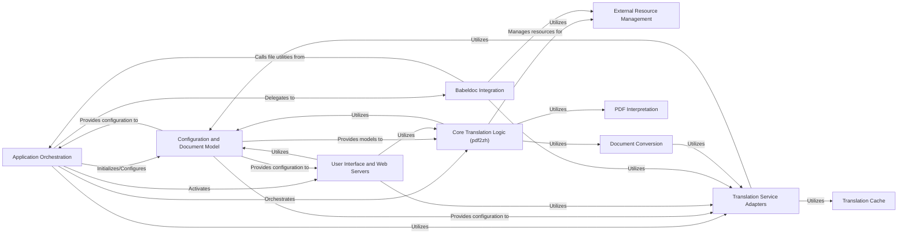

## Component Details

This graph represents the core components of the PDF translation application. The `Application Orchestration` acts as the central control, managing argument parsing, initializing services, and orchestrating the overall translation process. It interacts with `Configuration and Document Model` for settings and models, `User Interface and Web Servers` for user interaction, and `Core Translation Logic (pdf2zh)` or `Babeldoc Integration` for the actual translation workflow. `Translation Service Adapters` provide interfaces to various translation APIs, often utilizing a `Translation Cache`. `Core Translation Logic (pdf2zh)` further relies on `Document Conversion`, `PDF Interpretation`, and `External Resource Management` for document processing and resource handling.

### Application Orchestration
This component serves as the central control unit, handling argument parsing, initializing core application services (GUI, MCP server, document layout models, configuration), and orchestrating the overall translation process. It acts as the main entry point for different operational modes of the application.

**Related Classes/Methods**:

- <a href="https://github.com/Byaidu/PDFMathTranslate/blob/master/pdf2zh/pdf2zh.py#L246-L329" target="_blank" rel="noopener noreferrer">`pdf2zh.pdf2zh:main` (246:329)</a>
- <a href="https://github.com/Byaidu/PDFMathTranslate/blob/master/pdf2zh/pdf2zh.py#L205-L219" target="_blank" rel="noopener noreferrer">`pdf2zh.pdf2zh:parse_args` (205:219)</a>
- <a href="https://github.com/Byaidu/PDFMathTranslate/blob/master/pdf2zh/pdf2zh.py#L28-L202" target="_blank" rel="noopener noreferrer">`pdf2zh.pdf2zh:create_parser` (28:202)</a>
- <a href="https://github.com/Byaidu/PDFMathTranslate/blob/master/pdf2zh/pdf2zh.py#L332-L461" target="_blank" rel="noopener noreferrer">`pdf2zh.pdf2zh:yadt_main` (332:461)</a>
- <a href="https://github.com/Byaidu/PDFMathTranslate/blob/master/pdf2zh/pdf2zh.py#L222-L243" target="_blank" rel="noopener noreferrer">`pdf2zh.pdf2zh:find_all_files_in_directory` (222:243)</a>

### Configuration and Document Model
This component handles the loading and management of application-wide configurations and the initialization of the ONNX model used for document layout analysis. It ensures that the application operates with the correct settings and has access to the necessary document processing capabilities.

**Related Classes/Methods**:

- <a href="https://github.com/Byaidu/PDFMathTranslate/blob/master/pdf2zh/config.py#L80-L91" target="_blank" rel="noopener noreferrer">`pdf2zh.config.ConfigManager.custome_config` (80:91)</a>
- <a href="https://github.com/Byaidu/PDFMathTranslate/blob/master/pdf2zh/doclayout.py#L72-L175" target="_blank" rel="noopener noreferrer">`pdf2zh.doclayout.OnnxModel` (72:175)</a>
- <a href="https://github.com/Byaidu/PDFMathTranslate/blob/master/pdf2zh/doclayout.py#L32-L33" target="_blank" rel="noopener noreferrer">`pdf2zh.doclayout.DocLayoutModel.load_available` (32:33)</a>

### User Interface and Web Servers
This component provides various interfaces for user interaction and external system integration. It includes the setup for an interactive graphical user interface (GUI) and functionalities to launch different types of web servers, such as MCP, Flask, or Celery, allowing the translation service to be exposed via network protocols.

**Related Classes/Methods**:

- <a href="https://github.com/Byaidu/PDFMathTranslate/blob/master/pdf2zh/gui.py#L801-L882" target="_blank" rel="noopener noreferrer">`pdf2zh.gui.setup_gui` (801:882)</a>
- <a href="https://github.com/Byaidu/PDFMathTranslate/blob/master/pdf2zh/mcp_server.py#L16-L57" target="_blank" rel="noopener noreferrer">`pdf2zh.mcp_server.create_mcp_app` (16:57)</a>
- <a href="https://github.com/Byaidu/PDFMathTranslate/blob/master/pdf2zh/mcp_server.py#L60-L78" target="_blank" rel="noopener noreferrer">`pdf2zh.mcp_server.create_starlette_app` (60:78)</a>
- `pdf2zh.backend.flask_app` (full file reference)
- `pdf2zh.backend.celery_app` (full file reference)

### Core Translation Logic (pdf2zh)
This component encapsulates the primary high-level translation workflow specific to the 'pdf2zh' project. It orchestrates the steps involved in translating PDF documents, leveraging other components for parsing, model inference, and actual translation service calls.

**Related Classes/Methods**:

- <a href="https://github.com/Byaidu/PDFMathTranslate/blob/master/pdf2zh/high_level.py#L302-L397" target="_blank" rel="noopener noreferrer">`pdf2zh.high_level.translate` (302:397)</a>
- <a href="https://github.com/Byaidu/PDFMathTranslate/blob/master/pdf2zh/high_level.py#L400-L425" target="_blank" rel="noopener noreferrer">`pdf2zh.high_level.download_remote_fonts` (400:425)</a>

### Babeldoc Integration
An alternative and experimental translation backend that integrates with the 'babeldoc' library. This component provides advanced translation features and manages its own translation process, including initialization and asynchronous translation operations, often with progress handling.

**Related Classes/Methods**:

- `babeldoc.high_level.async_translate` (full file reference)
- `babeldoc.high_level.init` (full file reference)
- `babeldoc.main.create_progress_handler` (full file reference)

### Translation Service Adapters
This component comprises a collection of classes designed to interface with various third-party translation APIs. Each adapter provides a standardized way to communicate with different translation services (e.g., Google, DeepL, OpenAI), abstracting away the specifics of each API.

**Related Classes/Methods**:

- `pdf2zh.translator.GoogleTranslator` (full file reference)
- `pdf2zh.translator.AzureOpenAITranslator` (full file reference)
- `pdf2zh.translator.BingTranslator` (full file reference)
- `pdf2zh.translator.DeepLTranslator` (full file reference)
- `pdf2zh.translator.DeepLXTranslator` (full file reference)
- `pdf2zh.translator.OllamaTranslator` (full file reference)
- `pdf2zh.translator.XinferenceTranslator` (full file reference)
- `pdf2zh.translator.OpenAITranslator` (full file reference)
- `pdf2zh.translator.ZhipuTranslator` (full file reference)
- `pdf2zh.translator.ModelScopeTranslator` (full file reference)
- `pdf2zh.translator.SiliconTranslator` (full file reference)
- `pdf2zh.translator.GeminiTranslator` (full file reference)
- `pdf2zh.translator.AzureTranslator` (full file reference)
- `pdf2zh.translator.TencentTranslator` (full file reference)
- `pdf2zh.translator.DifyTranslator` (full file reference)
- `pdf2zh.translator.AnythingLLMTranslator` (full file reference)
- `pdf2zh.translator.ArgosTranslator` (full file reference)
- `pdf2zh.translator.GrokTranslator` (full file reference)
- `pdf2zh.translator.GroqTranslator` (full file reference)
- `pdf2zh.translator.DeepseekTranslator` (full file reference)
- `pdf2zh.translator.OpenAIlikedTranslator` (full file reference)
- `pdf2zh.translator.QwenMtTranslator` (full file reference)

### External Resource Management
This component is responsible for handling the downloading and management of external resources, primarily remote fonts, which are essential for correctly rendering translated documents. It ensures that all necessary assets are available for the translation and document generation processes.

**Related Classes/Methods**:

- <a href="https://github.com/Byaidu/PDFMathTranslate/blob/master/pdf2zh/high_level.py#L400-L425" target="_blank" rel="noopener noreferrer">`pdf2zh.high_level.download_remote_fonts` (400:425)</a>

### Document Conversion
This component is responsible for converting document content, likely preparing it for translation or post-translation processing. It interacts with translation services.

**Related Classes/Methods**:

- <a href="https://github.com/Byaidu/PDFMathTranslate/blob/master/pdf2zh/converter.py#L130-L527" target="_blank" rel="noopener noreferrer">`pdf2zh.converter.TranslateConverter` (130:527)</a>
- <a href="https://github.com/Byaidu/PDFMathTranslate/blob/master/pdf2zh/converter.py#L47-L114" target="_blank" rel="noopener noreferrer">`pdf2zh.converter.PDFConverterEx` (47:114)</a>

### PDF Interpretation
This component handles the low-level parsing and interpretation of PDF document structures, extracting text and layout information.

**Related Classes/Methods**:

- `pdf2zh.pdfinterp` (full file reference)

### Translation Cache
This component provides caching mechanisms for translation results to improve performance and reduce redundant API calls.

**Related Classes/Methods**:

- <a href="https://github.com/Byaidu/PDFMathTranslate/blob/master/pdf2zh/cache.py#L36-L95" target="_blank" rel="noopener noreferrer">`pdf2zh.cache.TranslationCache` (36:95)</a>

### [FAQ](https://github.com/CodeBoarding/GeneratedOnBoardings/tree/main?tab=readme-ov-file#faq)