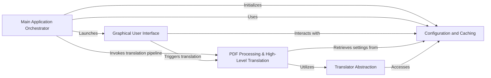

## Component Details

This graph illustrates the core components of the PDFMathTranslate application, focusing on how configuration settings and translation caching are managed and utilized across the system. The main application orchestrator initializes the system and dispatches tasks, while the GUI provides user interaction. The PDF processing component handles the document translation workflow, relying on an abstraction layer for various translation services. Central to the system, the Configuration and Caching component ensures persistent settings and efficient translation lookups, optimizing performance and maintaining data integrity.

### Main Application Orchestrator
This component serves as the primary entry point for the PDFMathTranslate application. It parses command-line arguments, initializes logging, sets up the document layout model (OnnxModel), and dispatches to either the GUI, a backend server, or directly initiates the translation process. It also handles custom configuration loading.

**Related Classes/Methods**:

- <a href="https://github.com/Byaidu/PDFMathTranslate/blob/master/pdf2zh/pdf2zh.py#L246-L329" target="_blank" rel="noopener noreferrer">`pdf2zh.pdf2zh:main` (246:329)</a>
- <a href="https://github.com/Byaidu/PDFMathTranslate/blob/master/pdf2zh/pdf2zh.py#L205-L219" target="_blank" rel="noopener noreferrer">`pdf2zh.pdf2zh:parse_args` (205:219)</a>
- <a href="https://github.com/Byaidu/PDFMathTranslate/blob/master/pdf2zh/pdf2zh.py#L28-L202" target="_blank" rel="noopener noreferrer">`pdf2zh.pdf2zh:create_parser` (28:202)</a>
- <a href="https://github.com/Byaidu/PDFMathTranslate/blob/master/pdf2zh/pdf2zh.py#L222-L243" target="_blank" rel="noopener noreferrer">`pdf2zh.pdf2zh:find_all_files_in_directory` (222:243)</a>
- <a href="https://github.com/Byaidu/PDFMathTranslate/blob/master/pdf2zh/pdf2zh.py#L332-L461" target="_blank" rel="noopener noreferrer">`pdf2zh.pdf2zh:yadt_main` (332:461)</a>

### Configuration and Caching
This component is responsible for managing all application configurations, including loading, saving, and accessing settings, as well as handling translator-specific environment variables. It also provides a caching mechanism for translated content to improve performance by storing and retrieving previously translated text, ensuring configuration persistence and integrity.

**Related Classes/Methods**:

- <a href="https://github.com/Byaidu/PDFMathTranslate/blob/master/pdf2zh/config.py#L8-L214" target="_blank" rel="noopener noreferrer">`pdf2zh.config.ConfigManager` (8:214)</a>
- <a href="https://github.com/Byaidu/PDFMathTranslate/blob/master/pdf2zh/config.py#L13-L20" target="_blank" rel="noopener noreferrer">`pdf2zh.config.ConfigManager:get_instance` (13:20)</a>
- <a href="https://github.com/Byaidu/PDFMathTranslate/blob/master/pdf2zh/config.py#L22-L32" target="_blank" rel="noopener noreferrer">`pdf2zh.config.ConfigManager:__init__` (22:32)</a>
- <a href="https://github.com/Byaidu/PDFMathTranslate/blob/master/pdf2zh/config.py#L34-L46" target="_blank" rel="noopener noreferrer">`pdf2zh.config.ConfigManager:_ensure_config_exists` (34:46)</a>
- <a href="https://github.com/Byaidu/PDFMathTranslate/blob/master/pdf2zh/config.py#L48-L52" target="_blank" rel="noopener noreferrer">`pdf2zh.config.ConfigManager:_load_config` (48:52)</a>
- <a href="https://github.com/Byaidu/PDFMathTranslate/blob/master/pdf2zh/config.py#L54-L60" target="_blank" rel="noopener noreferrer">`pdf2zh.config.ConfigManager:_save_config` (54:60)</a>
- <a href="https://github.com/Byaidu/PDFMathTranslate/blob/master/pdf2zh/config.py#L62-L77" target="_blank" rel="noopener noreferrer">`pdf2zh.config.ConfigManager:_remove_circular_references` (62:77)</a>
- <a href="https://github.com/Byaidu/PDFMathTranslate/blob/master/pdf2zh/config.py#L80-L91" target="_blank" rel="noopener noreferrer">`pdf2zh.config.ConfigManager:custome_config` (80:91)</a>
- <a href="https://github.com/Byaidu/PDFMathTranslate/blob/master/pdf2zh/config.py#L94-L117" target="_blank" rel="noopener noreferrer">`pdf2zh.config.ConfigManager:get` (94:117)</a>
- <a href="https://github.com/Byaidu/PDFMathTranslate/blob/master/pdf2zh/config.py#L120-L125" target="_blank" rel="noopener noreferrer">`pdf2zh.config.ConfigManager:set` (120:125)</a>
- <a href="https://github.com/Byaidu/PDFMathTranslate/blob/master/pdf2zh/config.py#L128-L135" target="_blank" rel="noopener noreferrer">`pdf2zh.config.ConfigManager:get_translator_by_name` (128:135)</a>
- <a href="https://github.com/Byaidu/PDFMathTranslate/blob/master/pdf2zh/config.py#L138-L152" target="_blank" rel="noopener noreferrer">`pdf2zh.config.ConfigManager:set_translator_by_name` (138:152)</a>
- <a href="https://github.com/Byaidu/PDFMathTranslate/blob/master/pdf2zh/config.py#L155-L184" target="_blank" rel="noopener noreferrer">`pdf2zh.config.ConfigManager:get_env_by_translatername` (155:184)</a>
- <a href="https://github.com/Byaidu/PDFMathTranslate/blob/master/pdf2zh/config.py#L187-L193" target="_blank" rel="noopener noreferrer">`pdf2zh.config.ConfigManager:delete` (187:193)</a>
- <a href="https://github.com/Byaidu/PDFMathTranslate/blob/master/pdf2zh/config.py#L196-L201" target="_blank" rel="noopener noreferrer">`pdf2zh.config.ConfigManager:clear` (196:201)</a>
- <a href="https://github.com/Byaidu/PDFMathTranslate/blob/master/pdf2zh/config.py#L204-L208" target="_blank" rel="noopener noreferrer">`pdf2zh.config.ConfigManager:all` (204:208)</a>
- <a href="https://github.com/Byaidu/PDFMathTranslate/blob/master/pdf2zh/config.py#L211-L214" target="_blank" rel="noopener noreferrer">`pdf2zh.config.ConfigManager:remove` (211:214)</a>
- <a href="https://github.com/Byaidu/PDFMathTranslate/blob/master/pdf2zh/cache.py#L36-L95" target="_blank" rel="noopener noreferrer">`pdf2zh.cache.TranslationCache` (36:95)</a>
- <a href="https://github.com/Byaidu/PDFMathTranslate/blob/master/pdf2zh/cache.py#L38-L47" target="_blank" rel="noopener noreferrer">`pdf2zh.cache.TranslationCache:_sort_dict_recursively` (38:47)</a>
- <a href="https://github.com/Byaidu/PDFMathTranslate/blob/master/pdf2zh/cache.py#L49-L54" target="_blank" rel="noopener noreferrer">`pdf2zh.cache.TranslationCache:__init__` (49:54)</a>
- <a href="https://github.com/Byaidu/PDFMathTranslate/blob/master/pdf2zh/cache.py#L59-L64" target="_blank" rel="noopener noreferrer">`pdf2zh.cache.TranslationCache:replace_params` (59:64)</a>
- <a href="https://github.com/Byaidu/PDFMathTranslate/blob/master/pdf2zh/cache.py#L66-L70" target="_blank" rel="noopener noreferrer">`pdf2zh.cache.TranslationCache:update_params` (66:70)</a>
- <a href="https://github.com/Byaidu/PDFMathTranslate/blob/master/pdf2zh/cache.py#L72-L74" target="_blank" rel="noopener noreferrer">`pdf2zh.cache.TranslationCache:add_params` (72:74)</a>
- <a href="https://github.com/Byaidu/PDFMathTranslate/blob/master/pdf2zh/cache.py#L78-L84" target="_blank" rel="noopener noreferrer">`pdf2zh.cache.TranslationCache:get` (78:84)</a>
- <a href="https://github.com/Byaidu/PDFMathTranslate/blob/master/pdf2zh/cache.py#L86-L95" target="_blank" rel="noopener noreferrer">`pdf2zh.cache.TranslationCache:set` (86:95)</a>
- <a href="https://github.com/Byaidu/PDFMathTranslate/blob/master/pdf2zh/cache.py#L98-L112" target="_blank" rel="noopener noreferrer">`pdf2zh.cache.init_db` (98:112)</a>
- <a href="https://github.com/Byaidu/PDFMathTranslate/blob/master/pdf2zh/cache.py#L115-L129" target="_blank" rel="noopener noreferrer">`pdf2zh.cache.init_test_db` (115:129)</a>
- <a href="https://github.com/Byaidu/PDFMathTranslate/blob/master/pdf2zh/cache.py#L132-L143" target="_blank" rel="noopener noreferrer">`pdf2zh.cache.clean_test_db` (132:143)</a>

### Translator Abstraction
This component defines the interface and base functionality for various translation services. It includes methods for setting environment variables and performing the actual translation. Subclasses implement specific translation APIs (e.g., Google, Bing, DeepL). It integrates with the TranslationCache to store and retrieve translations.

**Related Classes/Methods**:

- `pdf2zh.translator.BaseTranslator` (full file reference)
- `pdf2zh.translator.BaseTranslator:__init__` (full file reference)
- `pdf2zh.translator.BaseTranslator:set_envs` (full file reference)
- `pdf2zh.translator.BaseTranslator:add_cache_impact_parameters` (full file reference)
- `pdf2zh.translator.BaseTranslator:translate` (full file reference)
- `pdf2zh.translator.BaseTranslator:lang_mapping` (full file reference)
- `pdf2zh.translator.BaseTranslator:do_translate` (full file reference)

### PDF Processing & High-Level Translation
This component encapsulates the core PDF translation logic. It handles reading PDF streams, performing document layout analysis using an OnnxModel, extracting text, applying translations, and patching the PDF with translated content. It also manages font handling and remote font downloads.

**Related Classes/Methods**:

- <a href="https://github.com/Byaidu/PDFMathTranslate/blob/master/pdf2zh/high_level.py#L302-L397" target="_blank" rel="noopener noreferrer">`pdf2zh.high_level:translate` (302:397)</a>
- <a href="https://github.com/Byaidu/PDFMathTranslate/blob/master/pdf2zh/high_level.py#L70-L166" target="_blank" rel="noopener noreferrer">`pdf2zh.high_level:translate_patch` (70:166)</a>
- <a href="https://github.com/Byaidu/PDFMathTranslate/blob/master/pdf2zh/high_level.py#L169-L250" target="_blank" rel="noopener noreferrer">`pdf2zh.high_level:translate_stream` (169:250)</a>
- <a href="https://github.com/Byaidu/PDFMathTranslate/blob/master/pdf2zh/high_level.py#L400-L425" target="_blank" rel="noopener noreferrer">`pdf2zh.high_level:download_remote_fonts` (400:425)</a>
- <a href="https://github.com/Byaidu/PDFMathTranslate/blob/master/pdf2zh/high_level.py#L59-L67" target="_blank" rel="noopener noreferrer">`pdf2zh.high_level:check_files` (59:67)</a>
- <a href="https://github.com/Byaidu/PDFMathTranslate/blob/master/pdf2zh/high_level.py#L253-L299" target="_blank" rel="noopener noreferrer">`pdf2zh.high_level:convert_to_pdfa` (253:299)</a>

### Graphical User Interface
This component implements the Gradio-based web interface, allowing users to interact with the translation features. It handles user input, displays progress, and presents the translated output.

**Related Classes/Methods**:

- <a href="https://github.com/Byaidu/PDFMathTranslate/blob/master/pdf2zh/gui.py#L801-L882" target="_blank" rel="noopener noreferrer">`pdf2zh.gui:setup_gui` (801:882)</a>
- <a href="https://github.com/Byaidu/PDFMathTranslate/blob/master/pdf2zh/gui.py#L198-L352" target="_blank" rel="noopener noreferrer">`pdf2zh.gui:translate_file` (198:352)</a>
- <a href="https://github.com/Byaidu/PDFMathTranslate/blob/master/pdf2zh/gui.py#L181-L195" target="_blank" rel="noopener noreferrer">`pdf2zh.gui:stop_translate_file` (181:195)</a>
- <a href="https://github.com/Byaidu/PDFMathTranslate/blob/master/pdf2zh/gui.py#L139-L146" target="_blank" rel="noopener noreferrer">`pdf2zh.gui:verify_recaptcha` (139:146)</a>
- <a href="https://github.com/Byaidu/PDFMathTranslate/blob/master/pdf2zh/gui.py#L149-L178" target="_blank" rel="noopener noreferrer">`pdf2zh.gui:download_with_limit` (149:178)</a>
- `pdf2zh.gui:on_select_service` (full file reference)
- `pdf2zh.gui:on_select_filetype` (full file reference)
- `pdf2zh.gui:on_select_page` (full file reference)
- `pdf2zh.gui:on_vfont_change` (full file reference)
- <a href="https://github.com/Byaidu/PDFMathTranslate/blob/master/pdf2zh/gui.py#L355-L457" target="_blank" rel="noopener noreferrer">`pdf2zh.gui:babeldoc_translate_file` (355:457)</a>
- <a href="https://github.com/Byaidu/PDFMathTranslate/blob/master/pdf2zh/gui.py#L771-L798" target="_blank" rel="noopener noreferrer">`pdf2zh.gui:parse_user_passwd` (771:798)</a>

### [FAQ](https://github.com/CodeBoarding/GeneratedOnBoardings/tree/main?tab=readme-ov-file#faq)