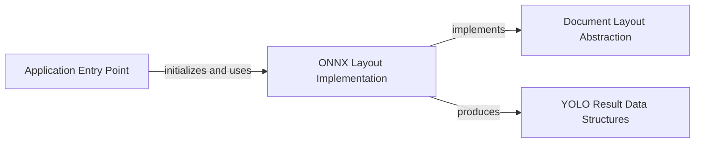

## Component Details

This graph illustrates the core components involved in the Document Layout Analysis subsystem of PDFMathTranslate. The `Application Entry Point` orchestrates the entire process, initializing and utilizing the `ONNX Layout Implementation`. The `ONNX Layout Implementation` provides a concrete realization of the `Document Layout Abstraction` and is responsible for processing documents using ONNX models, ultimately producing structured layout information represented by the `YOLO Result Data Structures`. The overall purpose is to accurately detect and categorize elements within a PDF for subsequent translation and re-rendering.

### Application Entry Point
This component serves as the main entry point for the PDFMathTranslate application. It is responsible for parsing command-line arguments, configuring logging, initializing the document layout model (specifically the ONNX model), and orchestrating the overall document processing and translation workflow, including handling different operational modes like interactive GUI, Flask, Celery, or direct translation.

**Related Classes/Methods**:

- <a href="https://github.com/Byaidu/PDFMathTranslate/blob/master/pdf2zh/pdf2zh.py#L246-L329" target="_blank" rel="noopener noreferrer">`pdf2zh.pdf2zh:main` (246:329)</a>

### Document Layout Abstraction
This component defines an abstract interface for document layout models. It provides a contract for how layout models should be loaded and how predictions should be made, ensuring flexibility and extensibility for different underlying model implementations. It includes static methods for loading available ONNX models.

**Related Classes/Methods**:

- <a href="https://github.com/Byaidu/PDFMathTranslate/blob/master/pdf2zh/doclayout.py#L25-L51" target="_blank" rel="noopener noreferrer">`pdf2zh.doclayout.DocLayoutModel` (25:51)</a>
- <a href="https://github.com/Byaidu/PDFMathTranslate/blob/master/pdf2zh/doclayout.py#L27-L29" target="_blank" rel="noopener noreferrer">`pdf2zh.doclayout.DocLayoutModel:load_onnx` (27:29)</a>
- <a href="https://github.com/Byaidu/PDFMathTranslate/blob/master/pdf2zh/doclayout.py#L32-L33" target="_blank" rel="noopener noreferrer">`pdf2zh.doclayout.DocLayoutModel:load_available` (32:33)</a>

### ONNX Layout Implementation
This component provides a concrete implementation of the Document Layout Abstraction using ONNX (Open Neural Network Exchange) models. It handles the loading of pre-trained ONNX models, preprocessing images (resizing and padding), performing inference, and post-processing the model's raw output into structured layout results, including scaling bounding boxes to original image dimensions.

**Related Classes/Methods**:

- <a href="https://github.com/Byaidu/PDFMathTranslate/blob/master/pdf2zh/doclayout.py#L72-L175" target="_blank" rel="noopener noreferrer">`pdf2zh.doclayout.OnnxModel` (72:175)</a>
- <a href="https://github.com/Byaidu/PDFMathTranslate/blob/master/pdf2zh/doclayout.py#L84-L86" target="_blank" rel="noopener noreferrer">`pdf2zh.doclayout.OnnxModel:from_pretrained` (84:86)</a>
- <a href="https://github.com/Byaidu/PDFMathTranslate/blob/master/pdf2zh/doclayout.py#L158-L175" target="_blank" rel="noopener noreferrer">`pdf2zh.doclayout.OnnxModel:predict` (158:175)</a>
- <a href="https://github.com/Byaidu/PDFMathTranslate/blob/master/pdf2zh/doclayout.py#L92-L130" target="_blank" rel="noopener noreferrer">`pdf2zh.doclayout.OnnxModel.resize_and_pad_image` (92:130)</a>
- <a href="https://github.com/Byaidu/PDFMathTranslate/blob/master/pdf2zh/doclayout.py#L132-L156" target="_blank" rel="noopener noreferrer">`pdf2zh.doclayout.OnnxModel.scale_boxes` (132:156)</a>

### YOLO Result Data Structures
This component defines the data structures used to represent the output of the YOLO-based ONNX layout model. It includes classes for encapsulating detected bounding boxes, their confidence scores, and class labels, providing a structured way to manage and access the layout prediction results.

**Related Classes/Methods**:

- <a href="https://github.com/Byaidu/PDFMathTranslate/blob/master/pdf2zh/doclayout.py#L54-L60" target="_blank" rel="noopener noreferrer">`pdf2zh.doclayout.YoloResult` (54:60)</a>
- <a href="https://github.com/Byaidu/PDFMathTranslate/blob/master/pdf2zh/doclayout.py#L57-L60" target="_blank" rel="noopener noreferrer">`pdf2zh.doclayout.YoloResult:__init__` (57:60)</a>
- <a href="https://github.com/Byaidu/PDFMathTranslate/blob/master/pdf2zh/doclayout.py#L63-L69" target="_blank" rel="noopener noreferrer">`pdf2zh.doclayout.YoloBox` (63:69)</a>

### [FAQ](https://github.com/CodeBoarding/GeneratedOnBoardings/tree/main?tab=readme-ov-file#faq)