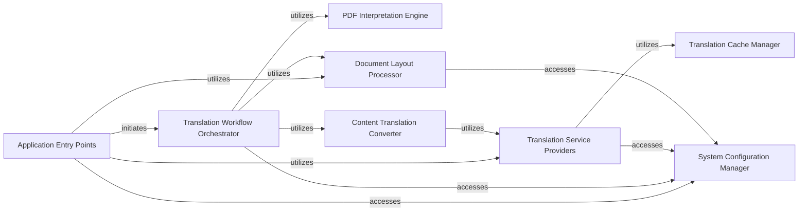

## Component Details

This architecture outlines the core components of the PDF translation system, from user interaction to the actual translation and PDF processing. The `Application Entry Points` initiate the translation workflow, which is orchestrated by the `Translation Workflow Orchestrator`. This orchestrator leverages the `PDF Interpretation Engine` to extract content, the `Content Translation Converter` for translation, and the `Document Layout Processor` for layout-related tasks. Translation services are provided by `Translation Service Providers`, which can utilize a `Translation Cache Manager` for efficiency. All components can access the `System Configuration Manager` for operational settings.

### Application Entry Points
This component encompasses the various ways users or systems can initiate the PDF translation process, including command-line interfaces, GUI interactions, and server-side requests. It acts as the initial interface to the PDFMathTranslate system.

**Related Classes/Methods**:

- <a href="https://github.com/Byaidu/PDFMathTranslate/blob/master/pdf2zh/pdf2zh.py#L246-L329" target="_blank" rel="noopener noreferrer">`pdf2zh.pdf2zh:main` (246:329)</a>
- <a href="https://github.com/Byaidu/PDFMathTranslate/blob/master/pdf2zh/pdf2zh.py#L332-L461" target="_blank" rel="noopener noreferrer">`pdf2zh.pdf2zh:yadt_main` (332:461)</a>
- <a href="https://github.com/Byaidu/PDFMathTranslate/blob/master/pdf2zh/mcp_server.py#L16-L57" target="_blank" rel="noopener noreferrer">`pdf2zh.mcp_server:create_mcp_app` (16:57)</a>
- <a href="https://github.com/Byaidu/PDFMathTranslate/blob/master/pdf2zh/backend.py#L39-L54" target="_blank" rel="noopener noreferrer">`pdf2zh.backend:translate_task` (39:54)</a>
- <a href="https://github.com/Byaidu/PDFMathTranslate/blob/master/pdf2zh/gui.py#L198-L352" target="_blank" rel="noopener noreferrer">`pdf2zh.gui:translate_file` (198:352)</a>

### Translation Workflow Orchestrator
This component is responsible for managing the high-level flow of the PDF translation process. It coordinates various sub-tasks such as file validation, PDF/A conversion, remote font downloading, and the core translation patching mechanism.

**Related Classes/Methods**:

- <a href="https://github.com/Byaidu/PDFMathTranslate/blob/master/pdf2zh/high_level.py#L302-L397" target="_blank" rel="noopener noreferrer">`PDFMathTranslate.pdf2zh.high_level:translate` (302:397)</a>
- <a href="https://github.com/Byaidu/PDFMathTranslate/blob/master/pdf2zh/high_level.py#L169-L250" target="_blank" rel="noopener noreferrer">`PDFMathTranslate.pdf2zh.high_level:translate_stream` (169:250)</a>
- <a href="https://github.com/Byaidu/PDFMathTranslate/blob/master/pdf2zh/high_level.py#L400-L425" target="_blank" rel="noopener noreferrer">`PDFMathTranslate.pdf2zh.high_level:download_remote_fonts` (400:425)</a>
- <a href="https://github.com/Byaidu/PDFMathTranslate/blob/master/pdf2zh/high_level.py#L59-L67" target="_blank" rel="noopener noreferrer">`PDFMathTranslate.pdf2zh.high_level:check_files` (59:67)</a>
- <a href="https://github.com/Byaidu/PDFMathTranslate/blob/master/pdf2zh/high_level.py#L253-L299" target="_blank" rel="noopener noreferrer">`PDFMathTranslate.pdf2zh.high_level:convert_to_pdfa` (253:299)</a>

### PDF Interpretation Engine
This component handles the low-level parsing and interpretation of PDF document structures. It is crucial for extracting content from PDF pages, which is then used for translation.

**Related Classes/Methods**:

- <a href="https://github.com/Byaidu/PDFMathTranslate/blob/master/pdf2zh/pdfinterp.py#L51-L366" target="_blank" rel="noopener noreferrer">`pdf2zh.pdfinterp.PDFPageInterpreterEx` (51:366)</a>
- <a href="https://github.com/Byaidu/PDFMathTranslate/blob/master/pdf2zh/pdfinterp.py#L254-L278" target="_blank" rel="noopener noreferrer">`pdf2zh.pdfinterp.PDFPageInterpreterEx.process_page` (254:278)</a>

### Content Translation Converter
This component is dedicated to the actual conversion and translation of text and other content extracted from the PDF. It likely contains the core logic for transforming source language content into the target language.

**Related Classes/Methods**:

- <a href="https://github.com/Byaidu/PDFMathTranslate/blob/master/pdf2zh/converter.py#L130-L527" target="_blank" rel="noopener noreferrer">`pdf2zh.converter.TranslateConverter` (130:527)</a>

### System Configuration Manager
This component provides access to system-wide configuration settings. It is used by other components to retrieve necessary parameters, such as font download locations or other operational settings.

**Related Classes/Methods**:

- <a href="https://github.com/Byaidu/PDFMathTranslate/blob/master/pdf2zh/config.py#L94-L117" target="_blank" rel="noopener noreferrer">`pdf2zh.config.ConfigManager.get` (94:117)</a>

### Translation Service Providers
This component encapsulates various external and internal translation services. It provides a unified interface for different translation APIs and models.

**Related Classes/Methods**:

- `pdf2zh.translator.BaseTranslator` (full file reference)
- `pdf2zh.translator.AnythingLLMTranslator` (full file reference)
- `pdf2zh.translator.ArgosTranslator` (full file reference)
- `pdf2zh.translator.AzureOpenAITranslator` (full file reference)
- `pdf2zh.translator.BingTranslator` (full file reference)
- `pdf2zh.translator.DeepLTranslator` (full file reference)
- `pdf2zh.translator.DeepLXTranslator` (full file reference)
- `pdf2zh.translator.GeminiTranslator` (full file reference)
- `pdf2zh.translator.GoogleTranslator` (full file reference)
- `pdf2zh.translator.OllamaTranslator` (full file reference)
- `pdf2zh.translator.OpenAITranslator` (full file reference)
- `pdf2zh.translator.SiliconTranslator` (full file reference)
- `pdf2zh.translator.XinferenceTranslator` (full file reference)
- `pdf2zh.translator.ZhipuTranslator` (full file reference)

### Document Layout Processor
This component is responsible for handling document layout-related tasks, potentially including font handling, image processing, and structural analysis of the PDF.

**Related Classes/Methods**:

- `pdf2zh.doclayout` (full file reference)
- <a href="https://github.com/Byaidu/PDFMathTranslate/blob/master/pdf2zh/doclayout.py#L72-L175" target="_blank" rel="noopener noreferrer">`pdf2zh.doclayout.OnnxModel` (72:175)</a>
- <a href="https://github.com/Byaidu/PDFMathTranslate/blob/master/pdf2zh/doclayout.py#L25-L51" target="_blank" rel="noopener noreferrer">`pdf2zh.doclayout.DocLayoutModel` (25:51)</a>

### Translation Cache Manager
This component manages the caching of translation results to improve performance and reduce redundant API calls.

**Related Classes/Methods**:

- <a href="https://github.com/Byaidu/PDFMathTranslate/blob/master/pdf2zh/cache.py#L36-L95" target="_blank" rel="noopener noreferrer">`pdf2zh.cache.TranslationCache` (36:95)</a>

### [FAQ](https://github.com/CodeBoarding/GeneratedOnBoardings/tree/main?tab=readme-ov-file#faq)