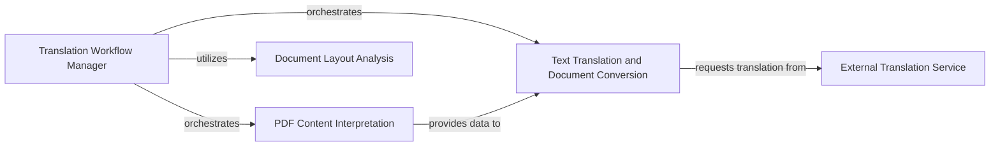

## Component Details

This subsystem, `PDF Content Processing`, is responsible for the comprehensive handling of PDF documents, from initial content extraction and layout analysis to text translation and final document conversion. It integrates various functionalities to transform raw PDF data into structured, translatable content, facilitating the translation workflow.

### Translation Workflow Manager
This component orchestrates the entire PDF translation process, handling input file validation, optional PDF/A conversion, font management, and coordinating the core translation and rendering steps.

**Related Classes/Methods**:

- <a href="https://github.com/Byaidu/PDFMathTranslate/blob/master/pdf2zh/high_level.py#L302-L397" target="_blank" rel="noopener noreferrer">`pdf2zh.high_level.translate` (302:397)</a>
- <a href="https://github.com/Byaidu/PDFMathTranslate/blob/master/pdf2zh/high_level.py#L169-L250" target="_blank" rel="noopener noreferrer">`pdf2zh.high_level.translate_stream` (169:250)</a>
- <a href="https://github.com/Byaidu/PDFMathTranslate/blob/master/pdf2zh/high_level.py#L70-L166" target="_blank" rel="noopener noreferrer">`pdf2zh.high_level.translate_patch` (70:166)</a>
- <a href="https://github.com/Byaidu/PDFMathTranslate/blob/master/pdf2zh/high_level.py#L59-L67" target="_blank" rel="noopener noreferrer">`pdf2zh.high_level.check_files` (59:67)</a>
- <a href="https://github.com/Byaidu/PDFMathTranslate/blob/master/pdf2zh/high_level.py#L253-L299" target="_blank" rel="noopener noreferrer">`pdf2zh.high_level.convert_to_pdfa` (253:299)</a>
- <a href="https://github.com/Byaidu/PDFMathTranslate/blob/master/pdf2zh/high_level.py#L400-L425" target="_blank" rel="noopener noreferrer">`pdf2zh.high_level.download_remote_fonts` (400:425)</a>

### PDF Content Interpretation
This component is responsible for the low-level parsing and interpretation of PDF page content, including graphical elements, text, and layout information. It extracts raw data from PDF documents for further processing.

**Related Classes/Methods**:

- <a href="https://github.com/Byaidu/PDFMathTranslate/blob/master/pdf2zh/pdfinterp.py#L51-L366" target="_blank" rel="noopener noreferrer">`pdf2zh.pdfinterp.PDFPageInterpreterEx` (51:366)</a>
- <a href="https://github.com/Byaidu/PDFMathTranslate/blob/master/pdf2zh/pdfinterp.py#L64-L65" target="_blank" rel="noopener noreferrer">`pdf2zh.pdfinterp.PDFPageInterpreterEx.dup` (64:65)</a>
- <a href="https://github.com/Byaidu/PDFMathTranslate/blob/master/pdf2zh/pdfinterp.py#L67-L110" target="_blank" rel="noopener noreferrer">`pdf2zh.pdfinterp.PDFPageInterpreterEx.init_resources` (67:110)</a>
- <a href="https://github.com/Byaidu/PDFMathTranslate/blob/master/pdf2zh/pdfinterp.py#L112-L135" target="_blank" rel="noopener noreferrer">`pdf2zh.pdfinterp.PDFPageInterpreterEx.do_S` (112:135)</a>
- <a href="https://github.com/Byaidu/PDFMathTranslate/blob/master/pdf2zh/pdfinterp.py#L188-L190" target="_blank" rel="noopener noreferrer">`pdf2zh.pdfinterp.PDFPageInterpreterEx.do_SC` (188:190)</a>
- <a href="https://github.com/Byaidu/PDFMathTranslate/blob/master/pdf2zh/pdfinterp.py#L192-L194" target="_blank" rel="noopener noreferrer">`pdf2zh.pdfinterp.PDFPageInterpreterEx.do_sc` (192:194)</a>
- <a href="https://github.com/Byaidu/PDFMathTranslate/blob/master/pdf2zh/pdfinterp.py#L196-L252" target="_blank" rel="noopener noreferrer">`pdf2zh.pdfinterp.PDFPageInterpreterEx.do_Do` (196:252)</a>
- <a href="https://github.com/Byaidu/PDFMathTranslate/blob/master/pdf2zh/pdfinterp.py#L254-L278" target="_blank" rel="noopener noreferrer">`pdf2zh.pdfinterp.PDFPageInterpreterEx.process_page` (254:278)</a>
- <a href="https://github.com/Byaidu/PDFMathTranslate/blob/master/pdf2zh/pdfinterp.py#L280-L299" target="_blank" rel="noopener noreferrer">`pdf2zh.pdfinterp.PDFPageInterpreterEx.render_contents` (280:299)</a>

### Text Translation and Document Conversion
This component manages the extraction of text from PDF layouts, sends it to an external translation service, and integrates the translated text back into the document structure. It also handles the base PDF conversion functionalities.

**Related Classes/Methods**:

- <a href="https://github.com/Byaidu/PDFMathTranslate/blob/master/pdf2zh/converter.py#L130-L527" target="_blank" rel="noopener noreferrer">`pdf2zh.converter.TranslateConverter` (130:527)</a>
- <a href="https://github.com/Byaidu/PDFMathTranslate/blob/master/pdf2zh/converter.py#L131-L166" target="_blank" rel="noopener noreferrer">`pdf2zh.converter.TranslateConverter.__init__` (131:166)</a>
- <a href="https://github.com/Byaidu/PDFMathTranslate/blob/master/pdf2zh/converter.py#L168-L527" target="_blank" rel="noopener noreferrer">`pdf2zh.converter.TranslateConverter.receive_layout` (168:527)</a>
- <a href="https://github.com/Byaidu/PDFMathTranslate/blob/master/pdf2zh/converter.py#L47-L114" target="_blank" rel="noopener noreferrer">`pdf2zh.converter.PDFConverterEx` (47:114)</a>
- <a href="https://github.com/Byaidu/PDFMathTranslate/blob/master/pdf2zh/converter.py#L48-L52" target="_blank" rel="noopener noreferrer">`pdf2zh.converter.PDFConverterEx.__init__` (48:52)</a>

### External Translation Service
Provides the actual translation of text using an external API (e.g., Google Translate) and incorporates a caching mechanism for efficiency.

**Related Classes/Methods**:

- `pdf2zh.translator.GoogleTranslator` (full file reference)
- `pdf2zh.translator.GoogleTranslator.__init__` (full file reference)
- `pdf2zh.translator.BaseTranslator` (full file reference)
- `pdf2zh.translator.BaseTranslator.translate` (full file reference)
- <a href="https://github.com/Byaidu/PDFMathTranslate/blob/master/pdf2zh/cache.py#L78-L84" target="_blank" rel="noopener noreferrer">`pdf2zh.cache.TranslationCache.get` (78:84)</a>
- <a href="https://github.com/Byaidu/PDFMathTranslate/blob/master/pdf2zh/cache.py#L86-L95" target="_blank" rel="noopener noreferrer">`pdf2zh.cache.TranslationCache.set` (86:95)</a>

### Document Layout Analysis
Analyzes the visual structure of PDF pages to identify and categorize different content elements, such as text blocks, images, and formulas.

**Related Classes/Methods**:

- <a href="https://github.com/Byaidu/PDFMathTranslate/blob/master/pdf2zh/doclayout.py#L72-L175" target="_blank" rel="noopener noreferrer">`pdf2zh.doclayout.OnnxModel` (72:175)</a>

### [FAQ](https://github.com/CodeBoarding/GeneratedOnBoardings/tree/main?tab=readme-ov-file#faq)