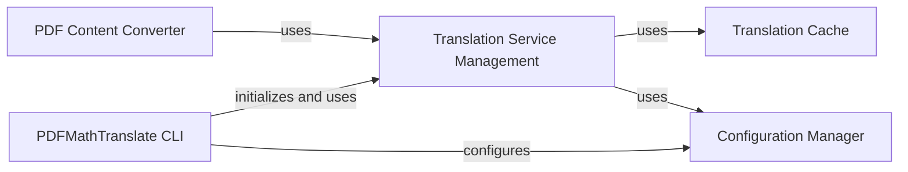

## Component Details

The PDFMathTranslate system is designed to translate PDF documents, specifically handling mathematical formulas. It operates via a command-line interface that orchestrates the workflow. The core functionality involves parsing PDF content, translating identified text and formulas using various external translation services, and then reconstructing the translated content back into a PDF-compatible format. A caching mechanism is employed to optimize performance by storing previous translations, and a configuration manager handles application-wide settings and API keys for the translation services.

### Translation Service Management
This component defines the interface and implements various concrete translation services (e.g., Google, Bing, DeepL, OpenAI). It handles the actual communication with external translation APIs, manages API keys/environment variables, and integrates with the caching mechanism to optimize translation performance.

**Related Classes/Methods**:

- <a href="https://github.com/Byaidu/PDFMathTranslate/blob/master/pdf2zh/translator.py#L10-L100" target="_blank" rel="noopener noreferrer">`pdf2zh.translator.BaseTranslator` (10:100)</a>
- `pdf2zh.translator.BaseTranslator:__init__` (full file reference)
- `pdf2zh.translator.BaseTranslator:set_envs` (full file reference)
- `pdf2zh.translator.BaseTranslator:add_cache_impact_parameters` (full file reference)
- `pdf2zh.translator.BaseTranslator:translate` (full file reference)
- `pdf2zh.translator.BaseTranslator:do_translate` (full file reference)
- `pdf2zh.translator.BaseTranslator:get_formular_placeholder` (full file reference)
- <a href="https://github.com/Byaidu/PDFMathTranslate/blob/master/pdf2zh/translator.py#L102-L150" target="_blank" rel="noopener noreferrer">`pdf2zh.translator.GoogleTranslator` (102:150)</a>
- `pdf2zh.translator.GoogleTranslator:__init__` (full file reference)
- `pdf2zh.translator.GoogleTranslator:do_translate` (full file reference)
- <a href="https://github.com/Byaidu/PDFMathTranslate/blob/master/pdf2zh/translator.py#L152-L165" target="_blank" rel="noopener noreferrer">`pdf2zh.translator.BingTranslator` (152:165)</a>
- `pdf2zh.translator.BingTranslator:__init__` (full file reference)
- `pdf2zh.translator.BingTranslator:do_translate` (full file reference)
- <a href="https://github.com/Byaidu/PDFMathTranslate/blob/master/pdf2zh/translator.py#L167-L177" target="_blank" rel="noopener noreferrer">`pdf2zh.translator.DeepLTranslator` (167:177)</a>
- `pdf2zh.translator.DeepLTranslator:__init__` (full file reference)
- `pdf2zh.translator.DeepLTranslator:do_translate` (full file reference)
- `pdf2zh.translator.DeepLXTranslator:__init__` (full file reference)
- `pdf2zh.translator.OllamaTranslator:__init__` (full file reference)
- `pdf2zh.translator.OllamaTranslator:do_translate` (full file reference)
- `pdf2zh.translator.XinferenceTranslator:__init__` (full file reference)
- `pdf2zh.translator.XinferenceTranslator:do_translate` (full file reference)
- <a href="https://github.com/Byaidu/PDFMathTranslate/blob/master/pdf2zh/translator.py#L179-L190" target="_blank" rel="noopener noreferrer">`pdf2zh.translator.OpenAITranslator` (179:190)</a>
- `pdf2zh.translator.OpenAITranslator:__init__` (full file reference)
- `pdf2zh.translator.OpenAITranslator:do_translate` (full file reference)
- `pdf2zh.translator.AzureOpenAITranslator:__init__` (full file reference)
- `pdf2zh.translator.AzureOpenAITranslator:do_translate` (full file reference)
- `pdf2zh.translator.ModelScopeTranslator:__init__` (full file reference)
- `pdf2zh.translator.ZhipuTranslator:__init__` (full file reference)
- `pdf2zh.translator.ZhipuTranslator:do_translate` (full file reference)
- `pdf2zh.translator.SiliconTranslator:__init__` (full file reference)
- `pdf2zh.translator.GeminiTranslator:__init__` (full file reference)
- `pdf2zh.translator.AzureTranslator:__init__` (full file reference)
- `pdf2zh.translator.TencentTranslator:__init__` (full file reference)
- `pdf2zh.translator.AnythingLLMTranslator:__init__` (full file reference)
- `pdf2zh.translator.AnythingLLMTranslator:do_translate` (full file reference)
- `pdf2zh.translator.DifyTranslator:__init__` (full file reference)
- `pdf2zh.translator.ArgosTranslator:__init__` (full file reference)
- `pdf2zh.translator.GrokTranslator:__init__` (full file reference)
- `pdf2zh.translator.GroqTranslator:__init__` (full file reference)
- `pdf2zh.translator.DeepseekTranslator:__init__` (full file reference)
- `pdf2zh.translator.OpenAIlikedTranslator:__init__` (full file reference)
- `pdf2zh.translator.QwenMtTranslator:__init__` (full file reference)
- `pdf2zh.translator.QwenMtTranslator:do_translate` (full file reference)
- <a href="https://github.com/Byaidu/PDFMathTranslate/blob/master/pdf2zh/translator.py#L192-L200" target="_blank" rel="noopener noreferrer">`pdf2zh.translator.remove_control_characters` (192:200)</a>

### PDFMathTranslate CLI
This is the command-line interface and entry point for the PDFMathTranslate application. It parses command-line arguments, initializes the necessary components like the document layout model and translation services, and orchestrates the overall PDF translation workflow, including handling different backend modes (interactive, flask, celery, mcp, babeldoc).

**Related Classes/Methods**:

- <a href="https://github.com/Byaidu/PDFMathTranslate/blob/master/pdf2zh/pdf2zh.py#L332-L461" target="_blank" rel="noopener noreferrer">`pdf2zh.pdf2zh:yadt_main` (332:461)</a>
- <a href="https://github.com/Byaidu/PDFMathTranslate/blob/master/pdf2zh/pdf2zh.py#L246-L329" target="_blank" rel="noopener noreferrer">`pdf2zh.pdf2zh:main` (246:329)</a>
- <a href="https://github.com/Byaidu/PDFMathTranslate/blob/master/pdf2zh/pdf2zh.py#L28-L202" target="_blank" rel="noopener noreferrer">`pdf2zh.pdf2zh:create_parser` (28:202)</a>
- <a href="https://github.com/Byaidu/PDFMathTranslate/blob/master/pdf2zh/pdf2zh.py#L205-L219" target="_blank" rel="noopener noreferrer">`pdf2zh.pdf2zh:parse_args` (205:219)</a>
- <a href="https://github.com/Byaidu/PDFMathTranslate/blob/master/pdf2zh/pdf2zh.py#L222-L243" target="_blank" rel="noopener noreferrer">`pdf2zh.pdf2zh:find_all_files_in_directory` (222:243)</a>

### Translation Cache
This component provides a caching mechanism for translated text, utilizing an SQLite database. It stores original text, translation engine details, and the corresponding translation to avoid re-translating identical content, improving performance and reducing API calls.

**Related Classes/Methods**:

- <a href="https://github.com/Byaidu/PDFMathTranslate/blob/master/pdf2zh/cache.py#L49-L54" target="_blank" rel="noopener noreferrer">`pdf2zh.cache.TranslationCache:__init__` (49:54)</a>
- <a href="https://github.com/Byaidu/PDFMathTranslate/blob/master/pdf2zh/cache.py#L72-L74" target="_blank" rel="noopener noreferrer">`pdf2zh.cache.TranslationCache.add_params` (72:74)</a>
- <a href="https://github.com/Byaidu/PDFMathTranslate/blob/master/pdf2zh/cache.py#L78-L84" target="_blank" rel="noopener noreferrer">`pdf2zh.cache.TranslationCache.get` (78:84)</a>
- <a href="https://github.com/Byaidu/PDFMathTranslate/blob/master/pdf2zh/cache.py#L86-L95" target="_blank" rel="noopener noreferrer">`pdf2zh.cache.TranslationCache.set` (86:95)</a>

### Configuration Manager
This singleton component manages the application's configuration, including translator-specific settings. It handles loading configurations from a JSON file, saving changes, and providing methods to retrieve and update settings, ensuring thread-safe access.

**Related Classes/Methods**:

- <a href="https://github.com/Byaidu/PDFMathTranslate/blob/master/pdf2zh/config.py#L128-L135" target="_blank" rel="noopener noreferrer">`pdf2zh.config.ConfigManager.get_translator_by_name` (128:135)</a>
- <a href="https://github.com/Byaidu/PDFMathTranslate/blob/master/pdf2zh/config.py#L138-L152" target="_blank" rel="noopener noreferrer">`pdf2zh.config.ConfigManager.set_translator_by_name` (138:152)</a>

### PDF Content Converter
This component extends PDFConverterEx to parse PDF layouts, identify text and mathematical formulas, and prepare content for translation. It integrates with a BaseTranslator instance to perform the actual translation and then re-layouts the translated content back into a PDF-compatible format.

**Related Classes/Methods**:

- <a href="https://github.com/Byaidu/PDFMathTranslate/blob/master/pdf2zh/converter.py#L131-L166" target="_blank" rel="noopener noreferrer">`pdf2zh.converter.TranslateConverter:__init__` (131:166)</a>
- <a href="https://github.com/Byaidu/PDFMathTranslate/blob/master/pdf2zh/converter.py#L168-L527" target="_blank" rel="noopener noreferrer">`pdf2zh.converter.TranslateConverter:receive_layout` (168:527)</a>

### [FAQ](https://github.com/CodeBoarding/GeneratedOnBoardings/tree/main?tab=readme-ov-file#faq)