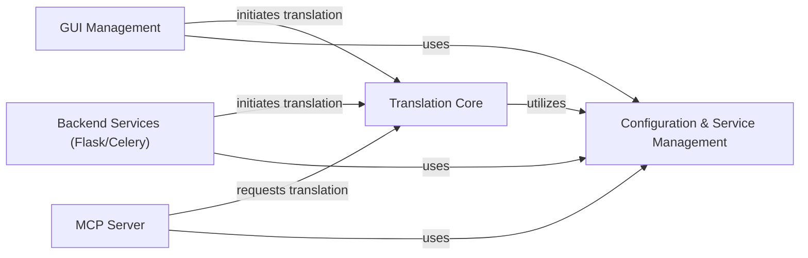

## Component Details

This graph illustrates the structure and interactions of the User Interface and Server Backends component within the PDF translation system. It encompasses the GUI for direct user interaction, and Flask, Celery, and MCP server backends for programmatic access and distributed processing. The core purpose is to provide various interfaces for users and other systems to initiate and manage PDF translation tasks, leveraging shared translation logic and configuration management.

### GUI Management
Manages the Gradio-based graphical user interface, handling user input, file operations, service selection, and initiating translation tasks.

**Related Classes/Methods**:

- <a href="https://github.com/Byaidu/PDFMathTranslate/blob/master/pdf2zh/gui.py#L801-L882" target="_blank" rel="noopener noreferrer">`PDFMathTranslate.pdf2zh.gui:setup_gui` (801:882)</a>
- <a href="https://github.com/Byaidu/PDFMathTranslate/blob/master/pdf2zh/gui.py#L771-L798" target="_blank" rel="noopener noreferrer">`PDFMathTranslate.pdf2zh.gui:parse_user_passwd` (771:798)</a>
- <a href="https://github.com/Byaidu/PDFMathTranslate/blob/master/pdf2zh/gui.py#L198-L352" target="_blank" rel="noopener noreferrer">`PDFMathTranslate.pdf2zh.gui:translate_file` (198:352)</a>
- <a href="https://github.com/Byaidu/PDFMathTranslate/blob/master/pdf2zh/gui.py#L181-L195" target="_blank" rel="noopener noreferrer">`PDFMathTranslate.pdf2zh.gui:stop_translate_file` (181:195)</a>
- <a href="https://github.com/Byaidu/PDFMathTranslate/blob/master/pdf2zh/gui.py#L355-L457" target="_blank" rel="noopener noreferrer">`PDFMathTranslate.pdf2zh.gui:babeldoc_translate_file` (355:457)</a>

### Backend Services (Flask/Celery)
Provides server-side functionalities using Flask for web requests and Celery for asynchronous task processing, specifically for PDF translation. It integrates with configuration, document layout, and the core translation logic.

**Related Classes/Methods**:

- <a href="https://github.com/Byaidu/PDFMathTranslate/blob/master/pdf2zh/backend.py#L10-L50" target="_blank" rel="noopener noreferrer">`PDFMathTranslate.pdf2zh.backend:flask_app` (10:50)</a>
- <a href="https://github.com/Byaidu/PDFMathTranslate/blob/master/pdf2zh/backend.py#L52-L100" target="_blank" rel="noopener noreferrer">`PDFMathTranslate.pdf2zh.backend:celery_app` (52:100)</a>

### MCP Server
Implements a Multi-Client Protocol (MCP) server interface, exposing a `translate_pdf` tool for external clients to request PDF translations and manage the process.

**Related Classes/Methods**:

- <a href="https://github.com/Byaidu/PDFMathTranslate/blob/master/pdf2zh/mcp_server.py#L16-L57" target="_blank" rel="noopener noreferrer">`PDFMathTranslate.pdf2zh.mcp_server:create_mcp_app` (16:57)</a>
- `PDFMathTranslate.pdf2zh.mcp_server:translate_pdf` (full file reference)
- <a href="https://github.com/Byaidu/PDFMathTranslate/blob/master/pdf2zh/mcp_server.py#L60-L78" target="_blank" rel="noopener noreferrer">`PDFMathTranslate.pdf2zh.mcp_server:create_starlette_app` (60:78)</a>

### Translation Core
Encapsulates the fundamental logic for translating PDF documents, including parsing, applying translation patches, font management, and integrating with various translation services to produce translated PDF outputs.

**Related Classes/Methods**:

- <a href="https://github.com/Byaidu/PDFMathTranslate/blob/master/pdf2zh/high_level.py#L169-L250" target="_blank" rel="noopener noreferrer">`PDFMathTranslate.pdf2zh.high_level:translate_stream` (169:250)</a>
- <a href="https://github.com/Byaidu/PDFMathTranslate/blob/master/pdf2zh/high_level.py#L70-L166" target="_blank" rel="noopener noreferrer">`PDFMathTranslate.pdf2zh.high_level:translate_patch` (70:166)</a>
- <a href="https://github.com/Byaidu/PDFMathTranslate/blob/master/pdf2zh/high_level.py#L302-L397" target="_blank" rel="noopener noreferrer">`PDFMathTranslate.pdf2zh.high_level:translate` (302:397)</a>
- <a href="https://github.com/Byaidu/PDFMathTranslate/blob/master/pdf2zh/high_level.py#L400-L425" target="_blank" rel="noopener noreferrer">`PDFMathTranslate.pdf2zh.high_level:download_remote_fonts` (400:425)</a>
- <a href="https://github.com/Byaidu/PDFMathTranslate/blob/master/pdf2zh/high_level.py#L59-L67" target="_blank" rel="noopener noreferrer">`PDFMathTranslate.pdf2zh.high_level:check_files` (59:67)</a>
- <a href="https://github.com/Byaidu/PDFMathTranslate/blob/master/pdf2zh/high_level.py#L253-L299" target="_blank" rel="noopener noreferrer">`PDFMathTranslate.pdf2zh.high_level:convert_to_pdfa` (253:299)</a>

### Configuration & Service Management
Manages application configurations, including enabled translation services, API keys, and provides a mapping of service names to their respective translator implementations and handles model instance management.

**Related Classes/Methods**:

- <a href="https://github.com/Byaidu/PDFMathTranslate/blob/master/pdf2zh/config.py#L8-L214" target="_blank" rel="noopener noreferrer">`PDFMathTranslate.pdf2zh.config.ConfigManager` (8:214)</a>
- `PDFMathTranslate.pdf2zh.translator.BaseTranslator` (full file reference)
- <a href="https://github.com/Byaidu/PDFMathTranslate/blob/master/pdf2zh/doclayout.py#L178-L179" target="_blank" rel="noopener noreferrer">`PDFMathTranslate.pdf2zh.doclayout.ModelInstance` (178:179)</a>

### [FAQ](https://github.com/CodeBoarding/GeneratedOnBoardings/tree/main?tab=readme-ov-file#faq)