```mermaid
graph LR
    Application_Orchestration["Application Orchestration"]
    High_Level_Translation_Logic["High-Level Translation Logic"]
    Translation_Service_Management["Translation Service Management"]
    Configuration_and_Caching["Configuration and Caching"]
    PDF_Content_Processing["PDF Content Processing"]
    Document_Layout_Analysis["Document Layout Analysis"]
    User_Interface_and_Server_Backends["User Interface and Server Backends"]
    Application_Orchestration -- "Orchestrates" --> High_Level_Translation_Logic
    Application_Orchestration -- "Initializes and accesses" --> Configuration_and_Caching
    Application_Orchestration -- "Loads and utilizes" --> Document_Layout_Analysis
    Application_Orchestration -- "Sets up and manages" --> User_Interface_and_Server_Backends
    High_Level_Translation_Logic -- "Retrieves settings from" --> Configuration_and_Caching
    High_Level_Translation_Logic -- "Utilizes for processing" --> PDF_Content_Processing
    High_Level_Translation_Logic -- "Invokes various" --> Translation_Service_Management
    Translation_Service_Management -- "Manages caching and configuration for" --> Configuration_and_Caching
    PDF_Content_Processing -- "Sends text to" --> Translation_Service_Management
    PDF_Content_Processing -- "Receives layout data from" --> Document_Layout_Analysis
    PDF_Content_Processing -- "Provides processed content to" --> High_Level_Translation_Logic
    Document_Layout_Analysis -- "Loads model configuration from" --> Configuration_and_Caching
    User_Interface_and_Server_Backends -- "Initiates translation via" --> High_Level_Translation_Logic
    User_Interface_and_Server_Backends -- "Manages user-specific settings via" --> Configuration_and_Caching
    User_Interface_and_Server_Backends -- "Directly uses" --> Translation_Service_Management
    click Application_Orchestration href "https://github.com/CodeBoarding/GeneratedOnBoardings/blob/main/PDFMathTranslate/Application Orchestration.md" "Details"
    click High_Level_Translation_Logic href "https://github.com/CodeBoarding/GeneratedOnBoardings/blob/main/PDFMathTranslate/High-Level Translation Logic.md" "Details"
    click Translation_Service_Management href "https://github.com/CodeBoarding/GeneratedOnBoardings/blob/main/PDFMathTranslate/Translation Service Management.md" "Details"
    click Configuration_and_Caching href "https://github.com/CodeBoarding/GeneratedOnBoardings/blob/main/PDFMathTranslate/Configuration and Caching.md" "Details"
    click PDF_Content_Processing href "https://github.com/CodeBoarding/GeneratedOnBoardings/blob/main/PDFMathTranslate/PDF Content Processing.md" "Details"
    click Document_Layout_Analysis href "https://github.com/CodeBoarding/GeneratedOnBoardings/blob/main/PDFMathTranslate/Document Layout Analysis.md" "Details"
    click User_Interface_and_Server_Backends href "https://github.com/CodeBoarding/GeneratedOnBoardings/blob/main/PDFMathTranslate/User Interface and Server Backends.md" "Details"
```

## Component Details

This graph illustrates the high-level architecture of the PDFMathTranslate application, designed for translating mathematical PDF documents. The main flow involves the Application Orchestration component initiating translation tasks, which are then handled by the High-Level Translation Logic. This logic interacts with PDF Content Processing to extract and format text, which is then sent to the Translation Service Management for actual translation. Configuration and Caching provides persistent settings and performance optimization, while Document Layout Analysis assists in understanding PDF structure. User Interface and Server Backends offer various interaction points for users and other systems.

### Application Orchestration
This component serves as the central control unit, handling argument parsing, initializing core application services (GUI, MCP server, document layout models, configuration), and orchestrating the overall translation process. It acts as the main entry point for different operational modes of the application.

**Related Classes/Methods**:

- <a href="https://github.com/Byaidu/PDFMathTranslate/blob/master/pdf2zh/pdf2zh.py#L246-L329" target="_blank" rel="noopener noreferrer">`PDFMathTranslate.pdf2zh.pdf2zh:main` (246:329)</a>
- <a href="https://github.com/Byaidu/PDFMathTranslate/blob/master/pdf2zh/pdf2zh.py#L205-L219" target="_blank" rel="noopener noreferrer">`PDFMathTranslate.pdf2zh.pdf2zh:parse_args` (205:219)</a>
- <a href="https://github.com/Byaidu/PDFMathTranslate/blob/master/pdf2zh/pdf2zh.py#L28-L202" target="_blank" rel="noopener noreferrer">`PDFMathTranslate.pdf2zh.pdf2zh:create_parser` (28:202)</a>
- <a href="https://github.com/Byaidu/PDFMathTranslate/blob/master/pdf2zh/pdf2zh.py#L332-L461" target="_blank" rel="noopener noreferrer">`PDFMathTranslate.pdf2zh.pdf2zh:yadt_main` (332:461)</a>
- <a href="https://github.com/Byaidu/PDFMathTranslate/blob/master/pdf2zh/pdf2zh.py#L222-L243" target="_blank" rel="noopener noreferrer">`PDFMathTranslate.pdf2zh.pdf2zh:find_all_files_in_directory` (222:243)</a>

### High-Level Translation Logic
This component encapsulates the core business logic for translating PDF files. It manages the translation workflow, including file checks, remote font downloads, and the actual invocation of translation services. It acts as an intermediary between the application's entry points and the specific translation and PDF processing components.

**Related Classes/Methods**:

- <a href="https://github.com/Byaidu/PDFMathTranslate/blob/master/pdf2zh/high_level.py#L302-L397" target="_blank" rel="noopener noreferrer">`PDFMathTranslate.pdf2zh.high_level:translate` (302:397)</a>
- <a href="https://github.com/Byaidu/PDFMathTranslate/blob/master/pdf2zh/high_level.py#L169-L250" target="_blank" rel="noopener noreferrer">`PDFMathTranslate.pdf2zh.high_level:translate_stream` (169:250)</a>
- <a href="https://github.com/Byaidu/PDFMathTranslate/blob/master/pdf2zh/high_level.py#L400-L425" target="_blank" rel="noopener noreferrer">`PDFMathTranslate.pdf2zh.high_level:download_remote_fonts` (400:425)</a>
- <a href="https://github.com/Byaidu/PDFMathTranslate/blob/master/pdf2zh/high_level.py#L59-L67" target="_blank" rel="noopener noreferrer">`PDFMathTranslate.pdf2zh.high_level:check_files` (59:67)</a>
- <a href="https://github.com/Byaidu/PDFMathTranslate/blob/master/pdf2zh/high_level.py#L253-L299" target="_blank" rel="noopener noreferrer">`PDFMathTranslate.pdf2zh.high_level:convert_to_pdfa` (253:299)</a>

### Translation Service Management
This component defines the interface and implements various concrete translation services (e.g., Google, Bing, DeepL, OpenAI). It handles the actual communication with external translation APIs, manages API keys/environment variables, and integrates with the caching mechanism to optimize translation performance.

**Related Classes/Methods**:

- <a href="https://github.com/Byaidu/PDFMathTranslate/blob/master/pdf2zh/translator.py#L10-L100" target="_blank" rel="noopener noreferrer">`PDFMathTranslate.pdf2zh.translator.BaseTranslator` (10:100)</a>
- <a href="https://github.com/Byaidu/PDFMathTranslate/blob/master/pdf2zh/translator.py#L102-L150" target="_blank" rel="noopener noreferrer">`PDFMathTranslate.pdf2zh.translator.GoogleTranslator` (102:150)</a>
- <a href="https://github.com/Byaidu/PDFMathTranslate/blob/master/pdf2zh/translator.py#L152-L165" target="_blank" rel="noopener noreferrer">`PDFMathTranslate.pdf2zh.translator.BingTranslator` (152:165)</a>
- <a href="https://github.com/Byaidu/PDFMathTranslate/blob/master/pdf2zh/translator.py#L167-L177" target="_blank" rel="noopener noreferrer">`PDFMathTranslate.pdf2zh.translator.DeepLTranslator` (167:177)</a>
- <a href="https://github.com/Byaidu/PDFMathTranslate/blob/master/pdf2zh/translator.py#L179-L190" target="_blank" rel="noopener noreferrer">`PDFMathTranslate.pdf2zh.translator.OpenAITranslator` (179:190)</a>
- <a href="https://github.com/Byaidu/PDFMathTranslate/blob/master/pdf2zh/translator.py#L192-L200" target="_blank" rel="noopener noreferrer">`PDFMathTranslate.pdf2zh.translator.remove_control_characters` (192:200)</a>

### Configuration and Caching
This component is responsible for managing all application configurations, including loading, saving, and accessing settings, as well as handling translator-specific environment variables. It also provides a caching mechanism for translated content to improve performance by storing and retrieving previously translated text, ensuring configuration persistence and integrity.

**Related Classes/Methods**:

- <a href="https://github.com/Byaidu/PDFMathTranslate/blob/master/pdf2zh/config.py#L8-L214" target="_blank" rel="noopener noreferrer">`PDFMathTranslate.pdf2zh.config.ConfigManager` (8:214)</a>
- <a href="https://github.com/Byaidu/PDFMathTranslate/blob/master/pdf2zh/cache.py#L36-L95" target="_blank" rel="noopener noreferrer">`PDFMathTranslate.pdf2zh.cache.TranslationCache` (36:95)</a>

### PDF Content Processing
This component handles the conversion and interpretation of PDF content. It extracts text and layout information from PDF documents, interacts with translation services to get translated content, and formats the content for output. It bridges the gap between raw PDF data and structured, translatable text.

**Related Classes/Methods**:

- <a href="https://github.com/Byaidu/PDFMathTranslate/blob/master/pdf2zh/converter.py#L130-L527" target="_blank" rel="noopener noreferrer">`PDFMathTranslate.pdf2zh.converter.TranslateConverter` (130:527)</a>
- <a href="https://github.com/Byaidu/PDFMathTranslate/blob/master/pdf2zh/converter.py#L47-L114" target="_blank" rel="noopener noreferrer">`PDFMathTranslate.pdf2zh.converter.PDFConverterEx` (47:114)</a>
- <a href="https://github.com/Byaidu/PDFMathTranslate/blob/master/pdf2zh/pdfinterp.py#L51-L366" target="_blank" rel="noopener noreferrer">`PDFMathTranslate.pdf2zh.pdfinterp.PDFPageInterpreterEx` (51:366)</a>

### Document Layout Analysis
This component is responsible for analyzing the visual layout of documents, primarily using ONNX models to detect and categorize elements within a PDF. It provides structured layout information, such as bounding boxes for text and images, which is crucial for accurate translation and re-rendering.

**Related Classes/Methods**:

- <a href="https://github.com/Byaidu/PDFMathTranslate/blob/master/pdf2zh/doclayout.py#L25-L51" target="_blank" rel="noopener noreferrer">`PDFMathTranslate.pdf2zh.doclayout.DocLayoutModel` (25:51)</a>
- <a href="https://github.com/Byaidu/PDFMathTranslate/blob/master/pdf2zh/doclayout.py#L72-L175" target="_blank" rel="noopener noreferrer">`PDFMathTranslate.pdf2zh.doclayout.OnnxModel` (72:175)</a>

### User Interface and Server Backends
This component encompasses the various interfaces through which users or other systems can interact with the PDF translation functionality. It includes the Graphical User Interface (GUI) for direct user interaction, as well as Flask, Celery, and Multi-Client Protocol (MCP) server backends for programmatic access and distributed processing.

**Related Classes/Methods**:

- <a href="https://github.com/Byaidu/PDFMathTranslate/blob/master/pdf2zh/gui.py#L801-L882" target="_blank" rel="noopener noreferrer">`PDFMathTranslate.pdf2zh.gui:setup_gui` (801:882)</a>
- <a href="https://github.com/Byaidu/PDFMathTranslate/blob/master/pdf2zh/mcp_server.py#L16-L57" target="_blank" rel="noopener noreferrer">`PDFMathTranslate.pdf2zh.mcp_server:create_mcp_app` (16:57)</a>
- <a href="https://github.com/Byaidu/PDFMathTranslate/blob/master/pdf2zh/mcp_server.py#L60-L78" target="_blank" rel="noopener noreferrer">`PDFMathTranslate.pdf2zh.mcp_server:create_starlette_app` (60:78)</a>
- <a href="https://github.com/Byaidu/PDFMathTranslate/blob/master/pdf2zh/backend.py#L10-L50" target="_blank" rel="noopener noreferrer">`PDFMathTranslate.pdf2zh.backend:flask_app` (10:50)</a>
- <a href="https://github.com/Byaidu/PDFMathTranslate/blob/master/pdf2zh/backend.py#L52-L100" target="_blank" rel="noopener noreferrer">`PDFMathTranslate.pdf2zh.backend:celery_app` (52:100)</a>

### [FAQ](https://github.com/CodeBoarding/GeneratedOnBoardings/tree/main?tab=readme-ov-file#faq)