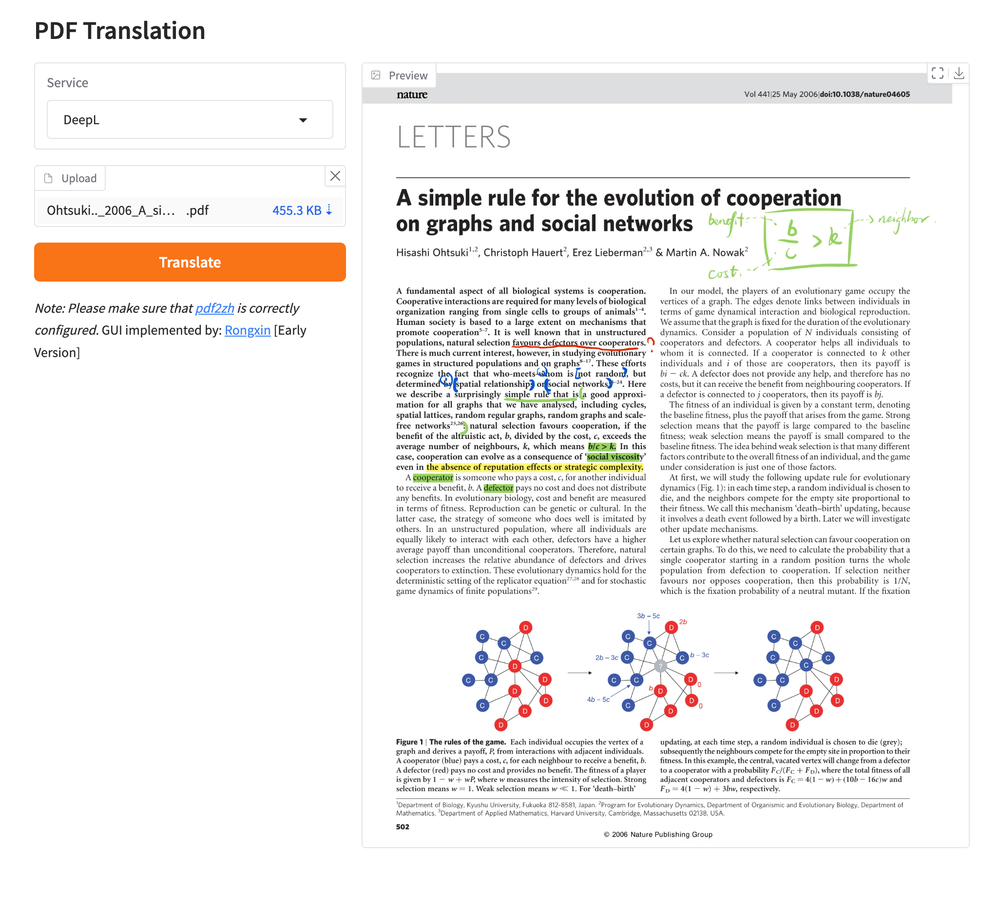
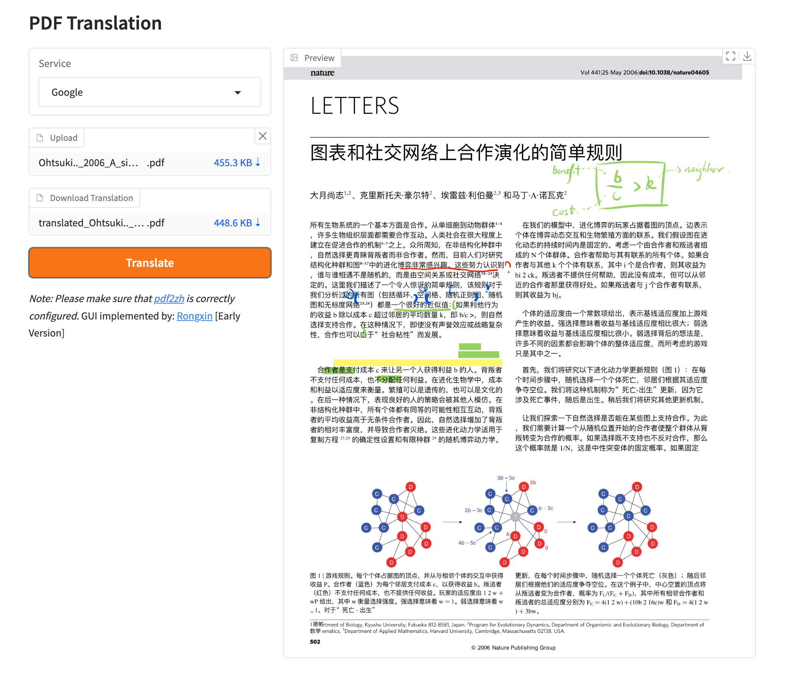

# Interact with GUI

This subfolder provides the GUI mode of `pdf2zh`.

## Usage

1. Run `pdf2zh -i`

2. Drop the PDF file into the window and click `Translate`.

### Environment Variables

You can set the source and target languages using environment variables:

- `PDF2ZH_LANG_FROM`: Sets the source language. Defaults to "English".
- `PDF2ZH_LANG_TO`: Sets the target language. Defaults to "Simplified Chinese".

### Supported Languages

The following languages are supported:

- English
- Simplified Chinese
- Traditional Chinese
- French
- German
- Japanese
- Korean
- Russian
- Spanish
- Italian

## Preview

## Maintainance

GUI maintained by [Rongxin](https://github.com/reycn)
