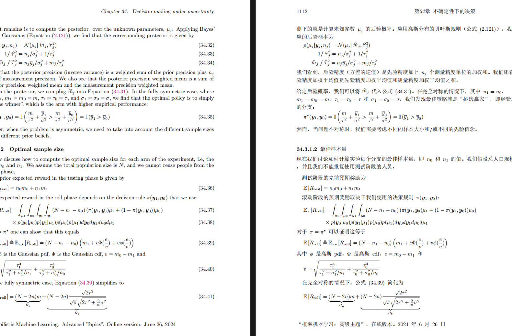
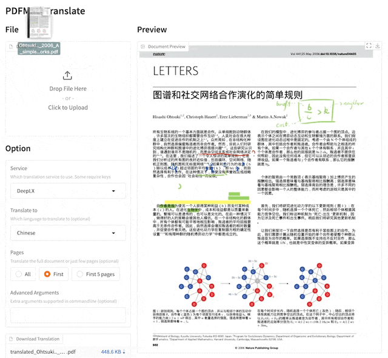
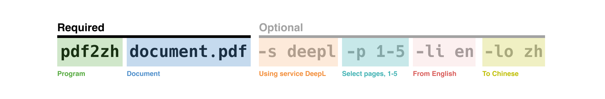

# Create new file

<div align="center">

[English](../README.md) | [简体中文](README_zh-CN.md) | [繁體中文](README_zh-TW.md) | [日本語](README_ja-JP.md) | 한국어


<h2 id="title">PDFMathTranslate</h2>

<p>
  <!-- PyPI -->
  <a href="https://pypi.org/project/pdf2zh/">
    </a>
  <a href="https://pepy.tech/projects/pdf2zh">
    </a>
  <a href="https://hub.docker.com/repository/docker/byaidu/pdf2zh">
    </a>
  <!-- License -->
  <a href="./LICENSE">
    </a>
  <a href="https://huggingface.co/spaces/reycn/PDFMathTranslate-Docker">
    </a>
  <a href="https://www.modelscope.cn/studios/AI-ModelScope/PDFMathTranslate">
    </a>
  <a href="https://github.com/Byaidu/PDFMathTranslate/pulls">
    </a>
  <a href="https://gitcode.com/Byaidu/PDFMathTranslate/overview">
    </a>
  <a href="https://t.me/+Z9_SgnxmsmA5NzBl">
    </a>
</p>

<a href="https://trendshift.io/repositories/12424" target="_blank"></a>

</div>

과학 PDF 문서 번역 및 이중 언어 비교 도구

- 📊 수식, 차트, 목차, 주석 유지 _([미리보기](#preview))_
- 🌐 [다양한 언어](#language)와 [다양한 번역 서비스](#services) 지원
- 🤖 [커맨드라인 도구](#usage), [대화형 사용자 인터페이스](#gui), 및 [Docker](#docker) 제공

피드백은 [GitHub Issues](https://github.com/Byaidu/PDFMathTranslate/issues) 또는 [Telegram 그룹](https://t.me/+Z9_SgnxmsmA5NzBl)에서 해주세요.

<h2 id="updates">최근 업데이트</h2>

- [2024년 12월 24일] [Xinference](https://github.com/xorbitsai/inference) 실행 로컬 LLM 지원 추가 _(by [@imClumsyPanda](https://github.com/imClumsyPanda))_
- [2024년 11월 26일] CLI가 온라인 파일을 지원하게 되었습니다 _(by [@reycn](https://github.com/reycn))_
- [2024년 11월 24일] 의존성 크기를 줄이기 위해 [ONNX](https://github.com/onnx/onnx) 지원 추가 _(by [@Wybxc](https://github.com/Wybxc))_
- [2024년 11월 23일] 🌟 [무료 공공 서비스](#demo) 온라인! _(by [@Byaidu](https://github.com/Byaidu))_
- [2024년 11월 23일] 웹 봇을 방지하기 위한 방화벽 추가 _(by [@Byaidu](https://github.com/Byaidu))_
- [2024년 11월 22일] GUI가 이탈리아어를 지원하고 개선되었습니다 _(by [@Byaidu](https://github.com/Byaidu), [@reycn](https://github.com/reycn))_
- [2024년 11월 22일] 배포된 서비스를 다른 사람과 공유할 수 있게 되었습니다 _(by [@Zxis233](https://github.com/Zxis233))_
- [2024년 11월 22일] Tencent 번역 지원 _(by [@hellofinch](https://github.com/hellofinch))_
- [2024년 11월 21일] GUI가 이중 언어 문서 다운로드를 지원하게 되었습니다 _(by [@reycn](https://github.com/reycn))_
- [2024년 11월 20일] 🌟 [데모](#demo)가 온라인이 되었습니다! _(by [@reycn](https://github.com/reycn))_

<h2 id="preview">미리보기</h2>

<div align="center">

</div>

<h2 id="demo">공공 서비스 🌟</h2>

### 무료 서비스 (<https://pdf2zh.com/>)

설치 없이 [무료 공공 서비스](https://pdf2zh.com/)를 온라인으로 사용해 볼 수 있습니다.

### 데모

설치 없이 [HuggingFace의 데모](https://huggingface.co/spaces/reycn/PDFMathTranslate-Docker)와 [ModelScope의 데모](https://www.modelscope.cn/studios/AI-ModelScope/PDFMathTranslate)를 사용해 볼 수 있습니다.
데모의 컴퓨팅 리소스가 제한되어 있으므로 남용하지 말아주세요.

<h2 id="install">설치 및 사용법</h2>

이 프로젝트를 사용하는 4가지 방법을 제공합니다: [커맨드라인 도구](#cmd), [포터블](#portable), [GUI](#gui), 및 [Docker](#docker).

pdf2zh 실행에는 추가 모델(`wybxc/DocLayout-YOLO-DocStructBench-onnx`)이 필요합니다. 이 모델은 ModelScope에서도 찾을 수 있습니다. 시작할 때 이 모델 다운로드에 문제가 있다면 다음 환경 변수를 사용하세요:

```shell
set HF_ENDPOINT=https://hf-mirror.com
```

PowerShell 사용자의 경우:

```shell
$env:HF_ENDPOINT = https://hf-mirror.com
```

<h3 id="cmd">방법 1. 커맨드라인 도구</h3>

1. Python이 설치되어 있어야 합니다 (버전 3.10 <= 버전 <= 3.12)
2. 패키지를 설치합니다:

   ```bash
   pip install pdf2zh
   ```

3. 번역을 실행하고 [현재 작업 디렉토리](https://chatgpt.com/share/6745ed36-9acc-800e-8a90-59204bd13444)에 파일을 생성합니다:

   ```bash
   pdf2zh document.pdf
   ```

<h3 id="portable">방법 2. 포터블</h3>

Python 환경을 미리 설치할 필요가 없습니다.

[setup.bat](https://raw.githubusercontent.com/Byaidu/PDFMathTranslate/refs/heads/main/script/setup.bat)을 다운로드하고 더블클릭하여 실행합니다.

<h3 id="gui">방법 3. GUI</h3>

1. Python이 설치되어 있어야 합니다 (버전 3.10 <= 버전 <= 3.12)
2. 패키지를 설치합니다:

   ```bash
   pip install pdf2zh
   ```

3. 브라우저에서 사용을 시작합니다:

   ```bash
   pdf2zh -i
   ```

4. 브라우저가 자동으로 시작되지 않으면 다음 URL을 엽니다:

   ```bash
   http://localhost:7860/
   ```

   

자세한 내용은 [GUI 문서](./README_GUI.md)를 참조하세요.

<h3 id="docker">방법 4. Docker</h3>

1. 풀하고 실행합니다:

   ```bash
   docker pull byaidu/pdf2zh
   docker run -d -p 7860:7860 byaidu/pdf2zh
   ```

2. 브라우저에서 엽니다:

   ```
   http://localhost:7860/
   ```

클라우드 서비스에서 Docker 배포용:

<div>
<a href="https://www.heroku.com/deploy?template=https://github.com/Byaidu/PDFMathTranslate">
  </a>
<a href="https://render.com/deploy">
  </a>
<a href="https://zeabur.com/templates/5FQIGX?referralCode=reycn">
  </a>
<a href="https://app.koyeb.com/deploy?type=git&builder=buildpack&repository=github.com/Byaidu/PDFMathTranslate&branch=main&name=pdf-math-translate">
  </a>
</div>

<h2 id="usage">고급 옵션</h2>

커맨드라인에서 번역 명령을 실행하여 현재 작업 디렉토리에 번역된 문서 `example-mono.pdf`와 이중 언어 문서 `example-dual.pdf`를 생성합니다. 기본적으로 Google 번역 서비스를 사용합니다. 더 많은 지원 번역 서비스는 [여기](https://github.com/Byaidu/PDFMathTranslate/blob/main/docs/ADVANCED.md#services)에서 찾을 수 있습니다.



다음 표에 참고용으로 모든 고급 옵션을 나열했습니다:

| 옵션           | 기능                                                                                                             | 예시                                           |
| -------------- | ---------------------------------------------------------------------------------------------------------------- | ---------------------------------------------- |
| files          | 로컬 파일                                                                                                        | `pdf2zh ~/local.pdf`                           |
| links          | 온라인 파일                                                                                                      | `pdf2zh http://arxiv.org/paper.pdf`            |
| `-i`           | [GUI 진입](#gui)                                                                                                 | `pdf2zh -i`                                    |
| `-p`           | [부분 문서 번역](#partial)                                                                                       | `pdf2zh example.pdf -p 1`                      |
| `-li`          | [소스 언어](#languages)                                                                                          | `pdf2zh example.pdf -li en`                    |
| `-lo`          | [대상 언어](#languages)                                                                                          | `pdf2zh example.pdf -lo zh`                    |
| `-s`           | [번역 서비스](#services)                                                                                         | `pdf2zh example.pdf -s deepl`                  |
| `-t`           | [멀티스레드](#threads)                                                                                           | `pdf2zh example.pdf -t 1`                      |
| `-o`           | 출력 디렉토리                                                                                                    | `pdf2zh example.pdf -o output`                 |
| `-f`, `-c`     | [예외](#exceptions)                                                                                              | `pdf2zh example.pdf -f "(MS.*)"`               |
| `--share`      | [gradio 공개 링크 얻기]                                                                                          | `pdf2zh -i --share`                            |
| `--authorized` | [[웹 인증 및 사용자 정의 인증 페이지 추가](https://github.com/Byaidu/PDFMathTranslate/blob/main/docs/ADVANCED.)] | `pdf2zh -i --authorized users.txt [auth.html]` |
| `--prompt`     | [사용자 정의 대형 모델 프롬프트 사용]                                                                            | `pdf2zh --prompt [prompt.txt]`                 |
| `--onnx`       | [사용자 정의 DocLayout-YOLO ONNX 모델 사용]                                                                      | `pdf2zh --onnx [onnx/model/path]`              |
| `--serverport` | [사용자 정의 WebUI 포트 사용]                                                                                    | `pdf2zh --serverport 7860`                     |
| `--dir`        | [배치 번역]                                                                                                      | `pdf2zh --dir /path/to/translate/`             |
| `--config`     | [구성 파일](https://github.com/Byaidu/PDFMathTranslate/blob/main/docs/ADVANCED.md#cofig)                         | `pdf2zh --config /path/to/config/config.json`  |

<h3 id="partial">전체 또는 부분 문서 번역</h3>

- **전체 번역**

```bash
pdf2zh example.pdf
```

- **부분 번역**

```bash
pdf2zh example.pdf -p 1-3,5
```

<h3 id="language">소스 언어와 대상 언어 지정</h3>

[Google Languages Codes](https://developers.google.com/admin-sdk/directory/v1/languages), [DeepL Languages Codes](https://developers.deepl.com/docs/resources/supported-languages) 참조

```bash
pdf2zh example.pdf -li en -lo ko
```

<h3 id="services">다른 서비스로 번역</h3>

다음 표는 각 번역 서비스에 필요한 [환경 변수](https://chatgpt.com/share/6734a83d-9d48-800e-8a46-f57ca6e8bcb4)를 보여줍니다. 각 서비스를 사용하기 전에 이러한 변수를 설정하세요.

| **번역기**          | **서비스**     | **환경 변수**                                                         | **기본값**                                               | **참고**                                                                                                                                                                                                   |
| ------------------- | -------------- | --------------------------------------------------------------------- | -------------------------------------------------------- | ---------------------------------------------------------------------------------------------------------------------------------------------------------------------------------------------------------- |
| **Google (기본)**   | `google`       | 없음                                                                  | N/A                                                      | 없음                                                                                                                                                                                                       |
| **Bing**            | `bing`         | 없음                                                                  | N/A                                                      | 없음                                                                                                                                                                                                       |
| **DeepL**           | `deepl`        | `DEEPL_AUTH_KEY`                                                      | `[Your Key]`                                             | [DeepL](https://support.deepl.com/hc/en-us/articles/360020695820-API-Key-for-DeepL-s-API) 참조                                                                                                             |
| **DeepLX**          | `deeplx`       | `DEEPLX_ENDPOINT`                                                     | `https://api.deepl.com/translate`                        | [DeepLX](https://github.com/OwO-Network/DeepLX) 참조                                                                                                                                                       |
| **Ollama**          | `ollama`       | `OLLAMA_HOST`, `OLLAMA_MODEL`                                         | `http://127.0.0.1:11434`, `gemma2`                       | [Ollama](https://github.com/ollama/ollama) 참조                                                                                                                                                            |
| **OpenAI**          | `openai`       | `OPENAI_BASE_URL`, `OPENAI_API_KEY`, `OPENAI_MODEL`                   | `https://api.openai.com/v1`, `[Your Key]`, `gpt-4o-mini` | [OpenAI](https://platform.openai.com/docs/overview) 참조                                                                                                                                                   |
| **AzureOpenAI**     | `azure-openai` | `AZURE_OPENAI_BASE_URL`, `AZURE_OPENAI_API_KEY`, `AZURE_OPENAI_MODEL` | `[Your Endpoint]`, `[Your Key]`, `gpt-4o-mini`           | [Azure OpenAI](https://learn.microsoft.com/zh-cn/azure/ai-services/openai/chatgpt-quickstart?tabs=command-line%2Cjavascript-keyless%2Ctypescript-keyless%2Cpython&pivots=programming-language-python) 참조 |
| **Zhipu**           | `zhipu`        | `ZHIPU_API_KEY`, `ZHIPU_MODEL`                                        | `[Your Key]`, `glm-4-flash`                              | [Zhipu](https://open.bigmodel.cn/dev/api/thirdparty-frame/openai-sdk) 참조                                                                                                                                 |
| **ModelScope**      | `modelscope`   | `MODELSCOPE_API_KEY`, `MODELSCOPE_MODEL`                              | `[Your Key]`, `Qwen/Qwen2.5-Coder-32B-Instruct`          | [ModelScope](https://www.modelscope.cn/docs/model-service/API-Inference/intro) 참조                                                                                                                        |
| **Silicon**         | `silicon`      | `SILICON_API_KEY`, `SILICON_MODEL`                                    | `[Your Key]`, `Qwen/Qwen2.5-7B-Instruct`                 | [SiliconCloud](https://docs.siliconflow.cn/quickstart) 참조                                                                                                                                                |
| **Gemini**          | `gemini`       | `GEMINI_API_KEY`, `GEMINI_MODEL`                                      | `[Your Key]`, `gemini-1.5-flash`                         | [Gemini](https://ai.google.dev/gemini-api/docs/openai) 참조                                                                                                                                                |
| **Azure**           | `azure`        | `AZURE_ENDPOINT`, `AZURE_API_KEY`                                     | `https://api.translator.azure.cn`, `[Your Key]`          | [Azure](https://docs.azure.cn/en-us/ai-services/translator/text-translation-overview) 참조                                                                                                                 |
| **Tencent**         | `tencent`      | `TENCENTCLOUD_SECRET_ID`, `TENCENTCLOUD_SECRET_KEY`                   | `[Your ID]`, `[Your Key]`                                | [Tencent](https://www.tencentcloud.com/products/tmt?from_qcintl=122110104) 참조                                                                                                                            |
| **Dify**            | `dify`         | `DIFY_API_URL`, `DIFY_API_KEY`                                        | `[Your DIFY URL]`, `[Your Key]`                          | [Dify](https://github.com/langgenius/dify) 참조, Dify의 워크플로우 입력에서 lang_out, lang_in, text 세 변수를 정의해야 합니다.                                                                             |
| **AnythingLLM**     | `anythingllm`  | `AnythingLLM_URL`, `AnythingLLM_APIKEY`                               | `[Your AnythingLLM URL]`, `[Your Key]`                   | [anything-llm](https://github.com/Mintplex-Labs/anything-llm) 참조                                                                                                                                         |
| **Argos Translate** | `argos`        |                                                                       |                                                          | [argos-translate](https://github.com/argosopentech/argos-translate) 참조                                                                                                                                   |
| **Grok**            | `grok`         | `GORK_API_KEY`, `GORK_MODEL`                                          | `[Your GORK_API_KEY]`, `grok-2-1212`                     | [Grok](https://docs.x.ai/docs/overview) 참조                                                                                                                                                               |
| **DeepSeek**        | `deepseek`     | `DEEPSEEK_API_KEY`, `DEEPSEEK_MODEL`                                  | `[Your DEEPSEEK_API_KEY]`, `deepseek-chat`               | [DeepSeek](https://www.deepseek.com/) 참조                                                                                                                                                                 |
| **OpenAI-Liked**    | `openailiked` | `OPENAILIKED_BASE_URL`, `OPENAILIKED_API_KEY`, `OPENAILIKED_MODEL`       | `url`, `[Your Key]`, `model name`                        | 없음                                                                                                                                                                                                       |

위 표에 없는 OpenAI API와 호환되는 대형 언어 모델의 경우, 표의 OpenAI와 동일한 방식으로 환경 변수를 설정할 수 있습니다.

`-s service` 또는 `-s service:model`을 사용하여 번역 서비스를 지정합니다:

```bash
pdf2zh example.pdf -s openai:gpt-4o-mini
```

또는 환경 변수로 모델을 지정합니다:

```bash
set OPENAI_MODEL=gpt-4o-mini
pdf2zh example.pdf -s openai
```

PowerShell 사용자의 경우:

```shell
$env:OPENAI_MODEL = gpt-4o-mini
pdf2zh example.pdf -s openai
```

<h3 id="exceptions">예외 지정</h3>

정규식을 사용하여 보존해야 할 수식 폰트와 문자를 지정합니다:

```bash
pdf2zh example.pdf -f "(CM[^RT].*|MS.*|.*Ital)" -c "(\(|\||\)|\+|=|\d|[\u0080-\ufaff])"
```

기본적으로 `Latex`, `Mono`, `Code`, `Italic`, `Symbol` 및 `Math` 폰트를 보존합니다:

```bash
pdf2zh example.pdf -f "(CM[^R]|MS.M|XY|MT|BL|RM|EU|LA|RS|LINE|LCIRCLE|TeX-|rsfs|txsy|wasy|stmary|.*Mono|.*Code|.*Ital|.*Sym|.*Math)"
```

<h3 id="threads">스레드 수 지정</h3>

`-t`를 사용하여 번역에 사용할 스레드 수를 지정합니다:

```bash
pdf2zh example.pdf -t 1
```

<h3 id="prompt">사용자 정의 프롬프트</h3>

`--prompt`를 사용하여 LLM에서 사용할 프롬프트를 지정합니다:

```bash
pdf2zh example.pdf -pr prompt.txt
```

`prompt.txt` 예시:

```txt
[
    {
        "role": "system",
        "content": "You are a professional,authentic machine translation engine.",
    },
    {
        "role": "user",
        "content": "Translate the following markdown source text to ${lang_out}. Keep the formula notation {{v*}} unchanged. Output translation directly without any additional text.\nSource Text: ${text}\nTranslated Text:",
    },
]
```

사용자 정의 프롬프트 파일에서는 다음 세 가지 변수를 사용할 수 있습니다:

| **변수**   | **내용**      |
| ---------- | ------------- |
| `lang_in`  | 소스 언어     |
| `lang_out` | 대상 언어     |
| `text`     | 번역할 텍스트 |

<h2 id="todo">API</h2>

### Python

```python
from pdf2zh import translate, translate_stream

params = {"lang_in": "en", "lang_out": "ko", "service": "google", "thread": 4}
file_mono, file_dual = translate(files=["example.pdf"], **params)[0]
with open("example.pdf", "rb") as f:
    stream_mono, stream_dual = translate_stream(stream=f.read(), **params)
```

### HTTP

```bash
pip install pdf2zh[backend]
pdf2zh --flask
pdf2zh --celery worker
```

```bash
curl http://localhost:11008/v1/translate -F "file=@example.pdf" -F "data={\"lang_in\":\"en\",\"lang_out\":\"ko\",\"service\":\"google\",\"thread\":4}"
{"id":"d9894125-2f4e-45ea-9d93-1a9068d2045a"}

curl http://localhost:11008/v1/translate/d9894125-2f4e-45ea-9d93-1a9068d2045a
{"info":{"n":13,"total":506},"state":"PROGRESS"}

curl http://localhost:11008/v1/translate/d9894125-2f4e-45ea-9d93-1a9068d2045a
{"state":"SUCCESS"}

curl http://localhost:11008/v1/translate/d9894125-2f4e-45ea-9d93-1a9068d2045a/mono --output example-mono.pdf

curl http://localhost:11008/v1/translate/d9894125-2f4e-45ea-9d93-1a9068d2045a/dual --output example-dual.pdf

curl http://localhost:11008/v1/translate/d9894125-2f4e-45ea-9d93-1a9068d2045a -X DELETE
```

<h2 id="acknowledgement">감사의 말</h2>

- 문서 병합: [PyMuPDF](https://github.com/pymupdf/PyMuPDF)
- 문서 파싱: [Pdfminer.six](https://github.com/pdfminer/pdfminer.six)
- 문서 추출: [MinerU](https://github.com/opendatalab/MinerU)
- 문서 미리보기: [Gradio PDF](https://github.com/freddyaboulton/gradio-pdf)
- 멀티스레드 번역: [MathTranslate](https://github.com/SUSYUSTC/MathTranslate)
- 레이아웃 파싱: [DocLayout-YOLO](https://github.com/opendatalab/DocLayout-YOLO)
- 문서 표준: [PDF Explained](https://zxyle.github.io/PDF-Explained/), [PDF Cheat Sheets](https://pdfa.org/resource/pdf-cheat-sheets/)
- 다국어 폰트: [Go Noto Universal](https://github.com/satbyy/go-noto-universal)

<h2 id="contrib">기여자</h2>

<a href="https://github.com/Byaidu/PDFMathTranslate/graphs/contributors">
  
</a>


<h2 id="star_hist">스타 히스토리</h2>

<a href="https://star-history.com/#Byaidu/PDFMathTranslate&Date">
 <picture>
   <source media="(prefers-color-scheme: dark)" srcset="https://api.star-history.com/svg?repos=Byaidu/PDFMathTranslate&type=Date&theme=dark" />
   <source media="(prefers-color-scheme: light)" srcset="https://api.star-history.com/svg?repos=Byaidu/PDFMathTranslate&type=Date" />
   
 </picture>
</a>
