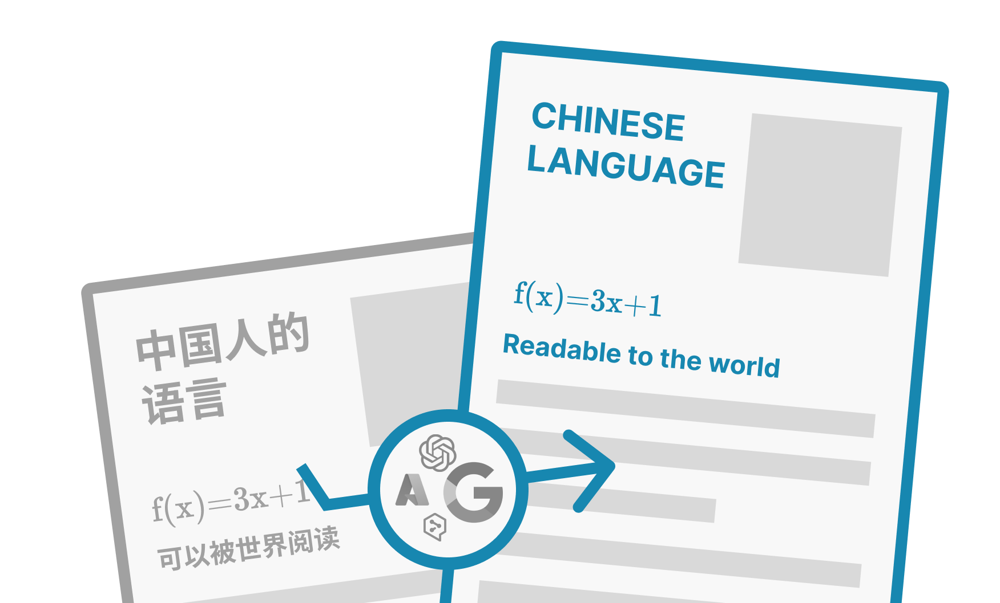
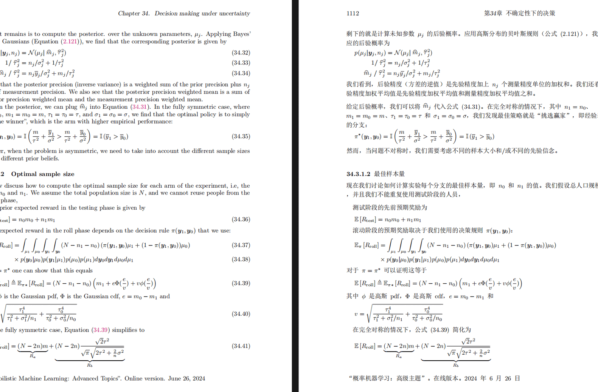
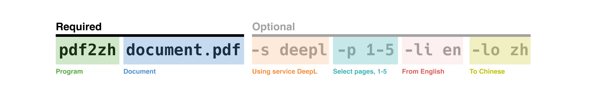

<div align="center">

[English](../README.md) | 简体中文 | [繁體中文](README_zh-TW.md) | [日本語](README_ja-JP.md)

  

<h2 id="title">PDFMathTranslate</h2>

<p>
  <!-- PyPI -->
  <a href="https://pypi.org/project/pdf2zh/">
    </a>
  <a href="https://pepy.tech/projects/pdf2zh">
    </a>
  <a href="https://hub.docker.com/repository/docker/byaidu/pdf2zh">
    </a>
  <!-- License -->
  <a href="./LICENSE">
    </a>
  <a href="https://huggingface.co/spaces/reycn/PDFMathTranslate-Docker">
    </a>
  <a href="https://www.modelscope.cn/studios/AI-ModelScope/PDFMathTranslate">
    </a>
  <a href="https://github.com/Byaidu/PDFMathTranslate/pulls">
    </a>
  <a href="https://gitcode.com/Byaidu/PDFMathTranslate/overview">
    </a>
  <a href="https://t.me/+Z9_SgnxmsmA5NzBl">
    </a>
</p>

<a href="https://trendshift.io/repositories/12424" target="_blank"></a>

</div>

科学 PDF 文档翻译及双语对照工具

- 📊 保留公式、图表、目录和注释 *([预览效果](#preview))*
- 🌐 支持 [多种语言](#language) 和 [诸多翻译服务](#services)
- 🤖 提供 [命令行工具](#usage)，[图形交互界面](#gui)，以及 [容器化部署](#docker)

欢迎在 [GitHub Issues](https://github.com/Byaidu/PDFMathTranslate/issues) 或 [Telegram 用户群](https://t.me/+Z9_SgnxmsmA5NzBl)

有关如何贡献的详细信息，请查阅 [贡献指南](https://github.com/Byaidu/PDFMathTranslate/wiki/Contribution-Guide---%E8%B4%A1%E7%8C%AE%E6%8C%87%E5%8D%97)

<h2 id="updates">更新</h2>

- [2025年2月22日] 更好的发布 CI 和精心打包的 windows-amd64 exe (由 [@awwaawwa](https://github.com/awwaawwa) 提供)
- [2024年12月24日] 翻译器现在支持在 [Xinference](https://github.com/xorbitsai/inference) 上使用本地模型 _(由 [@imClumsyPanda](https://github.com/imClumsyPanda) 提供)_
- [2024年12月19日] 现在支持非 PDF/A 文档，使用 `-cp` _(由 [@reycn](https://github.com/reycn) 提供)_
- [2024年12月13日] 额外支持后端 _(由 [@YadominJinta](https://github.com/YadominJinta) 提供)_
- [2024年12月10日] 翻译器现在支持 Azure 上的 OpenAI 模型 _(由 [@yidasanqian](https://github.com/yidasanqian) 提供)_

<h2 id="preview">预览</h2>
<div align="center">

</div>

<h2 id="demo">在线演示 🌟</h2>

<h2 id="demo">在线服务 🌟</h2>

您可以通过以下演示尝试我们的应用程序：

- [公共免费服务](https://pdf2zh.com/) 在线使用，无需安装 _(推荐)_。
- [沉浸式翻译 - BabelDOC](https://app.immersivetranslate.com/babel-doc/) 每月免费 1000 页 _(推荐)_
- [在 HuggingFace 上托管的演示](https://huggingface.co/spaces/reycn/PDFMathTranslate-Docker)
- [在 ModelScope 上托管的演示](https://www.modelscope.cn/studios/AI-ModelScope/PDFMathTranslate) 无需安装。

请注意演示的计算资源有限，请避免滥用它们。
<h2 id="install">安装和使用</h2>

### 方法

针对不同的使用案例，我们提供不同的方法来使用我们的程序：

<details open>
  <summary>1. UV 安装</summary>

1. 安装 Python (3.10 <= 版本 <= 3.12)
2. 安装我们的包：

   ```bash
   pip install uv
   uv tool install --python 3.12 pdf2zh
   ```

3. 执行翻译，文件生成在 [当前工作目录](https://chatgpt.com/share/6745ed36-9acc-800e-8a90-59204bd13444)：

   ```bash
   pdf2zh document.pdf
   ```

</details>

<details>
  <summary>2. Windows exe</summary>

1. 从 [发布页面](https://github.com/Byaidu/PDFMathTranslate/releases) 下载 pdf2zh-version-win64.zip

2. 解压缩并双击 `pdf2zh.exe` 运行。

</details>

<details>
  <summary>3. 图形用户界面</summary>
1. 安装 Python (3.10 <= 版本 <= 3.12)
2. 安装我们的包：

```bash
pip install pdf2zh
```

3. 在浏览器中开始使用：

   ```bash
   pdf2zh -i
   ```

4. 如果您的浏览器没有自动启动，请访问

   ```bash
   http://localhost:7860/
   ```

   

有关更多详细信息，请参阅 [GUI 文档](./docs/README_GUI.md)。

</details>

<details>
  <summary>4. Docker</summary>

1. 拉取并运行：

   ```bash
   docker pull byaidu/pdf2zh
   docker run -d -p 7860:7860 byaidu/pdf2zh
   ```

2. 在浏览器中打开:

   ```
   http://localhost:7860/
   ```

对于云服务上的docker部署:

<div>
<a href="https://www.heroku.com/deploy?template=https://github.com/Byaidu/PDFMathTranslate">
  </a>
<a href="https://render.com/deploy">
  </a>
<a href="https://zeabur.com/templates/5FQIGX?referralCode=reycn">
  </a>
<a href="https://app.koyeb.com/deploy?type=git&builder=buildpack&repository=github.com/Byaidu/PDFMathTranslate&branch=main&name=pdf-math-translate">
  </a>
</div>

</details>

<details>
  <summary>5. Zotero 插件</summary>

有关更多细节，请参见 [Zotero PDF2zh](https://github.com/guaguastandup/zotero-pdf2zh)。

</details>

<details>
  <summary>6. 命令行</summary>

1. 已安装Python（3.10 <= 版本 <= 3.12）
2. 安装我们的包:

   ```bash
   pip install pdf2zh
   ```

3. 执行翻译，文件生成在 [当前工作目录](https://chatgpt.com/share/6745ed36-9acc-800e-8a90-59204bd13444):

   ```bash
   pdf2zh document.pdf
   ```

</details>

> [!TIP]
>
> - 如果你使用Windows并在下载后无法打开文件，请安装 [vc_redist.x64.exe](https://aka.ms/vs/17/release/vc_redist.x64.exe) 并重试。
>
> - 如果你无法访问Docker Hub，请尝试在 [GitHub容器注册中心](https://github.com/Byaidu/PDFMathTranslate/pkgs/container/pdfmathtranslate) 上使用该镜像。
> ```bash
> docker pull ghcr.io/byaidu/pdfmathtranslate
> docker run -d -p 7860:7860 ghcr.io/byaidu/pdfmathtranslate
> ```

### 无法安装？

当前程序在工作前需要一个AI模型(`wybxc/DocLayout-YOLO-DocStructBench-onnx`)，一些用户由于网络问题无法下载。如果你在下载此模型时遇到问题，我们提供以下环境变量的解决方法:

```shell
set HF_ENDPOINT=https://hf-mirror.com
```

对于 PowerShell 用户：

```shell
$env:HF_ENDPOINT = https://hf-mirror.com
```

如果此解决方案对您无效或您遇到其他问题，请参阅 [常见问题解答](https://github.com/Byaidu/PDFMathTranslate/wiki#-faq--%E5%B8%B8%E8%A7%81%E9%97%AE%E9%A2%98)。


<h2 id="usage">高级选项</h2>

在命令行中执行翻译命令，在当前工作目录下生成译文文档 `example-mono.pdf` 和双语对照文档 `example-dual.pdf`，默认使用 Google 翻译服务，更多支持的服务在[这里](https://github.com/Byaidu/PDFMathTranslate/blob/main/docs/ADVANCED.md#services))。

  

在下表中，我们列出了所有高级选项供参考：

| 选项         | 功能                                                                                                          | 示例                                           |
| ------------ | ------------------------------------------------------------------------------------------------------------- | ---------------------------------------------- |
| files        | 本地文件                                                                                                     | `pdf2zh ~/local.pdf`                           |
| links        | 在线文件                                                                                                     | `pdf2zh http://arxiv.org/paper.pdf`            |
| `-i`         | [进入 GUI](#gui)                                                                                            | `pdf2zh -i`                                    |
| `-p`         | [部分文档翻译](https://github.com/Byaidu/PDFMathTranslate/blob/main/docs/ADVANCED.md#partial)                | `pdf2zh example.pdf -p 1`                      |
| `-li`        | [源语言](https://github.com/Byaidu/PDFMathTranslate/blob/main/docs/ADVANCED.md#languages)                    | `pdf2zh example.pdf -li en`                    |
| `-lo`        | [目标语言](https://github.com/Byaidu/PDFMathTranslate/blob/main/docs/ADVANCED.md#languages)                  | `pdf2zh example.pdf -lo zh`                    |
| `-s`         | [翻译服务](https://github.com/Byaidu/PDFMathTranslate/blob/main/docs/ADVANCED.md#services)                   | `pdf2zh example.pdf -s deepl`                  |
| `-t`         | [多线程](https://github.com/Byaidu/PDFMathTranslate/blob/main/docs/ADVANCED.md#threads)                      | `pdf2zh example.pdf -t 1`                      |
| `-o`         | 输出目录                                                                                                     | `pdf2zh example.pdf -o output`                 |
| `-f`, `-c`   | [异常](https://github.com/Byaidu/PDFMathTranslate/blob/main/docs/ADVANCED.md#exceptions)                     | `pdf2zh example.pdf -f "(MS.*)"`               |
| `-cp`        | 兼容模式                                                                                                     | `pdf2zh example.pdf --compatible`              |
| `--share`    | 公开链接                                                                                                     | `pdf2zh -i --share`                            |
| `--authorized` | [授权](https://github.com/Byaidu/PDFMathTranslate/blob/main/docs/ADVANCED.md#auth)                         | `pdf2zh -i --authorized users.txt [auth.html]` |
| `--prompt`   | [自定义提示](https://github.com/Byaidu/PDFMathTranslate/blob/main/docs/ADVANCED.md#prompt)                   | `pdf2zh --prompt [prompt.txt]`                 |
| `--onnx`     | [使用自定义 DocLayout-YOLO ONNX 模型]                                                                        | `pdf2zh --onnx [onnx/model/path]`              |
| `--serverport` | [使用自定义 WebUI 端口]                                                                                    | `pdf2zh --serverport 7860`                     |
| `--dir`      | [批量翻译]                                                                                                   | `pdf2zh --dir /path/to/translate/`             |
| `--config`   | [配置文件](https://github.com/Byaidu/PDFMathTranslate/blob/main/docs/ADVANCED.md#cofig)                       | `pdf2zh --config /path/to/config/config.json`  |
| `--serverport` | [自定义 gradio 服务器端口]                                                                                 | `pdf2zh --serverport 7860`                     |

有关详细说明，请参阅我们的文档 [高级用法](./docs/ADVANCED.md)，以获取每个选项的完整列表。

<h2 id="downstream">二次开发 (API)</h2>

对于下游应用程序，请参阅我们的文档 [API 详细信息](./docs/APIS.md)，以获取更多信息：
- [Python API](./docs/APIS.md#api-python)，如何在其他 Python 程序中使用该程序
- [HTTP API](./docs/APIS.md#api-http)，如何与已安装该程序的服务器进行通信

<h2 id="todo">待办事项</h2>

- [ ] 使用基于 DocLayNet 的模型解析布局，[PaddleX](https://github.com/PaddlePaddle/PaddleX/blob/17cc27ac3842e7880ca4aad92358d3ef8555429a/paddlex/repo_apis/PaddleDetection_api/object_det/official_categories.py#L81)，[PaperMage](https://github.com/allenai/papermage/blob/9cd4bb48cbedab45d0f7a455711438f1632abebe/README.md?plain=1#L102)，[SAM2](https://github.com/facebookresearch/sam2)

- [ ] 修复页面旋转、目录、列表格式

- [ ] 修复旧论文中的像素公式

- [ ] 异步重试，除了 KeyboardInterrupt

- [ ] 针对西方语言的 Knuth–Plass 算法

- [ ] 支持非 PDF/A 文件

- [ ] [Zotero](https://github.com/zotero/zotero) 和 [Obsidian](https://github.com/obsidianmd/obsidian-releases) 的插件

<h2 id="acknowledgement">致谢</h2>

- [Immersive Translation](https://immersivetranslate.com) 为此项目的活跃贡献者提供每月的专业会员兑换码，详细信息请查看：[CONTRIBUTOR_REWARD.md](https://github.com/funstory-ai/BabelDOC/blob/main/docs/CONTRIBUTOR_REWARD.md)

- 文档合并：[PyMuPDF](https://github.com/pymupdf/PyMuPDF)

- 文档解析：[Pdfminer.six](https://github.com/pdfminer/pdfminer.six)

- 文档提取：[MinerU](https://github.com/opendatalab/MinerU)

- 文档预览：[Gradio PDF](https://github.com/freddyaboulton/gradio-pdf)

- 多线程翻译：[MathTranslate](https://github.com/SUSYUSTC/MathTranslate)

- 布局解析：[DocLayout-YOLO](https://github.com/opendatalab/DocLayout-YOLO)

- 文档标准：[PDF Explained](https://zxyle.github.io/PDF-Explained/)，[PDF Cheat Sheets](https://pdfa.org/resource/pdf-cheat-sheets/)

- 多语言字体：[Go Noto Universal](https://github.com/satbyy/go-noto-universal)

<h2 id="contrib">贡献者</h2>

<a href="https://github.com/Byaidu/PDFMathTranslate/graphs/contributors">
  
</a>


<h2 id="star_hist">星标历史</h2>

<a href="https://star-history.com/#Byaidu/PDFMathTranslate&Date">
 <picture>
   <source media="(prefers-color-scheme: dark)" srcset="https://api.star-history.com/svg?repos=Byaidu/PDFMathTranslate&type=Date&theme=dark" />
   <source media="(prefers-color-scheme: light)" srcset="https://api.star-history.com/svg?repos=Byaidu/PDFMathTranslate&type=Date" />
   
 </picture>
</a>
